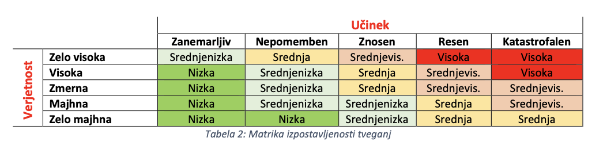

# :yellow_square: Predlog projekta

|                             |                                                                   |
| :-------------------------- | :---------------------------------------------------------------- |
| **Naziv projekta**          | Informacijski sistem za podporo glasovanju (ISPG)                 |
| **Kraj in datum**           | Ljubljana, 13. 3. 2023                                            |

## Povzetek projekta

Projekt zadeva modernizacijo beleženja volilne udeležbe in glasovanja po pošti z informacijskim sistemom namenjenemu prav temu delu izvajanja volitev. Digitalizacija volitev ni sama sebi namen, ampak prinaša vrsto prednosti, tako administrativnih kot lažje uveljavljanje volilne pravice izven dodeljenega volišča, saj v taki ureditvi vsa volišča postanejo OMNIA volišča brez potrebe po predhodnji najavi. Poleg tega je z verigo blokov podprta boljša revizijska sled in bolj zanesljiva verifikacija dejanske udeležbe volilca. Sistem je zamišljen kot pretežno interni, saj je predvsem namenjen v podporo delu volilnih organov. Kljub temu pa se lahko zaledni del s pomočjo aplikacijskih vmesnikov integrira z obstoječimi aplikacijami (npr. za sporočanje in prikazovanje rezultatov volitev, vključno s samo volilno udeležbo), omogoča pa lahko tudi nove uporabe kot so npr. podrobno spremljanje udeležbe opazovalcem in raziskovalcem volitev. Zaradi občutljivosti področja je predvidena bolj težka metodologija razvoja, saj je potrebno zagotoviti visoko stopnjo varnosti sistema in osebnih podatkov. Iz teh razlogov mora biti rešitev tudi odprtokodna.

## 1. Projektna ideja

### 1.1 Ozadje

Za izvedbo skoraj vseh volitev je potrebno natančno evidentiranje volilcev za preverjanje obstoja volilne pravice in da se tiste, ki so že prejeli glasovnice zabeleži in se jim s tem prepreči, da bi volili dvakrat. V Sloveniji se volilni imenik se sestavi iz Evidence volilne pravice (EVP) in Centralnega registra prebivalstva (CRP). [1]

Beleženje prisotnosti posameznih volilcev na volitvah pa je pomembno tudi za ugotavljanje volilne udeležbe kot deleža vseh volilnih upravičencev. Ta se ponavadi periodično (v Sloveniji ponavadi za 11., 16. in 19. uro) poroča med in po volitvami. Po volitvah se na podlagi podatkov iz volilnega imenika pripravi tudi geografska (po volilnih enotah, okrajih in voliščih) in demografska (po spolu in starosti) analiza udeležbe, iz katere so razvidni trendi volilnega telesa.

Volilne komisije skrbijo tudi za obveščanje volilcev pred volitvami, kar ponavadi izvedejo s poštnim obvestilom na dom, kjer jim povedo, na katerem volišču lahko volijo in pod katero številko v volilnem imeniku so vpisani. Za hitrejšo identifikacijo je priporočeno, da volilec to obvestilo prinese sabo na volišče, vendar je tudi to dokaj redka praksa in zato traja nekaj časa preden se volilca dejansko najde v imeniku. Na volišču zakonodaja nalaga preverjanje istovetnosti volilca z uporabo osebnega dokumenta. Ta se nato podpiše v volilni imenik in s tem zabeleži svojo udeležbo.

Dodatno kompleksnost vnašajo t.i. OMNIA volišča, ki omogočajo volilcem, da volijo na drugem volišču kot je določeno glede na stalen naslov prebivalca. Poleg tega je možno voliti tudi predčasno, v tujini, na domu ali po pošti, kjer se istovetnost z osebnim dokumentom ne preverja. V primeru glasovanja po pošti lahko pride tudi do tega, da volilec odda volilno karto po pošti, zraven pa se pojavi tudi na volišču.

Preko eUprave ali na upravni enoti lahko volilec z obrazcem tudi zahteva, da se mu volilno gradivo pošlje po pošti, vendar pa statusa le tega ne more spremljati.

V okviru projekta je namen razviti le rešitev za Slovenijo, saj bi glede na občutljivost področja ta morala biti tudi odprtokodna in posledično enostavna za kopiranje s strani drugih držav. Poleg tega so zahteve v Sloveniji dokaj specifične, saj ostali infomacijski sistemi za sporočanje in objavljanje rezultatov že obstajajo, poleg tega pa je uvoz podatkov tudi odvisen od formata evidenc. Drugih rešitev za ta zelo majhen trg (kupec je namreč lahko le Državna volilna komisija) zato tudi ni, se pa podobni sistemi uporabljajo v tujini. [2] Širše gledano, bi se lahko prilagojen sistem uporabljal tudi za druge oblike volitev kot so strankarske, korporativne ali univerzitetne oz. študentske korporativne.

### 1.2 Področje in motivacija

Za projekt smo se odločili, ker je zgoraj opisana organizacijska in digitalna vrzel dokaj očitna in je skrajni čas, da jo neka celovita rešitev tudi zapolni. Kljub vsem napredkom v informacijski tehnologiji, se udeležba na volitvah še vedno beleži na analogen način: z natisnjenim volilnim imenikom, na katerega se mora volilcec fizično podpisati. Istovetnost volilcev se pogosto ne preverja in zadostuje le lastnoročni podpis v volilnem imeniku. Analogen postopek je zaradi človeškega faktorja podvržen tudi človeškim napakam, ki pa pri zaradi eksaktnosti procesov pri informacijski tehnologiji načeloma niso prisotni.

Digitalizacija pomeni tudi, da je skupaj s tehnologijo verige blokov zagotovljena boljša sledljivost, saj sistem lahko na verigo zabeleži kateri član volilne komisije (ki je prijavljen v uporabniškega odjemalca) je volilca označil v volilnem imeniku in mu podelil glasovnico, volilec pa se v volilni imenik digitalno podpiše, kar dokazuje, da se je volilec zares v imenik podpisal ob določenem času na določenem volišču. To lahko člane volilne komisije tudi prisili v legitimiranje volilcev, kar pa se pogosto (sploh v manjših krajih) ne dogaja kljub zakonskim zahtevam. Nove osebne izkaznice vsebujejo tudi digitalna potrdila, ki bi se pravtako lahko v sistemu kriptografsko zabeležila, s čimer bi bilo dokazano, da se je volilec res pojavil na določenem volišču. Tako evidentiranje (za razliko od podpisovanja s priloženim pisalom) je brezkontaktno, kar je lahko tudi prednost v zaostrenih epidemioloških razmerah.

Kot zunanji vir bi se uporabljale javne evidence iz katerih bi se pridobivali podatki o volilni pravici, hkrati pa bi se lahko v njih podatki tudi urejali, zapisovali ali brisali, npr. označevanje EVP, da se prepreči štetje glasov prejetih po pošti od oseb, ki so že glasovale na volišču.

Izboljšan je tudi zasebnostni vidik, saj volilec ob podpisu pri prevzemu glasovnice ne more videti status udeležbe sosedov. Trenutni sistem sicer predvideva uporabo šablone, ki bi osebne podatke sosedov zakrile, vendar se v praksi ne uporablja. [3] Poleg tega ni potrebno, da volilni delavci vidijo celo vrsto osebnih podatkov, ki so vpisani v imeniku.

Prehod na digitalno rešitev bi doprinesel tudi občutno racionalizacijo dela volilnih komisij. Trenutni sistem od volilne komisije zahteva, da beleži udeležbo lastnoročno (ponavadi s črticami) in jo za določene ure (s kar precejšnjo zakasnitvijo) tudi sporoča. To predstavlja nepotrebno duplikacijo dela in opočasnjuje procesiranje volilcem na voliščih, kar je še posebej problem na večjih voliščih, kjer lahko pride do daljših vrst. Informatizacija bi tudi lahko omogočila volilcem, da se lahko zglasijo na katerem koli volišču, kar efektivno pomeni, da vsa volišča postanejo OMNIA volišča. To pomeni tudi občutno manj birokracije, saj volilcem ni potrebno izpolnjevati dodatnih obrazcev, da lahko volijo izven kraja stalnega prebivališča, hkrati pa je to tudi manjša obremenitev za javno upravo oz. volilne komisije. Dolgoročno bi se tudi pokazal prihranek, saj ne bi bilo več potrebno tiskati volilnih imenikov, kar je na vsakim volitvah kar zajeten strošek.

Izdelek je namenjen za Državno volilno komisijo (DVK), ki se z našo analizo očitno strinja saj je 17. 2. 2022 na Službo Vlade Republike Slovenije za digitalno preobrazbo in Ministrstvo za notranje zadeve naslovila izhodišča za začetek projekta Elektronski volilni imenik. V obrazloživi je prišla do podobnih (mi imamo še navedenih še kakšen razlog več) zaključkov kot naša ekipa. [1] Prepričevanje kupca torej ni potrebno, saj že sam išče zastavljeno rešitev. Konec koncev pa je naša motivacija tudi zaslužek.

Uveljavitev bi imela tudi pozitivne posredne stranke učinke, saj bi uporaba takega sistema narekovala nakup računalnikov za posamezne volilne komisije. DVK je v svojem pozivu tako omenila tudi možnost nadradnje informacijskega sistema isDVK, ki se uporablja za vpisovanje izidov volitev, tako da bi te podatke lahko vpisovali že na samih voliščih.

### 1.3 Namen

Glavni namen projekta je:

- Vsa volišča postanejo OMNIA volišča: bolj dostopne volitve
- Zaradi beleženja, kateri član volilne komisije je volilca označil v imeniku se jih prisili v preverjanje istovetnosti in omogoča tudi boljše uveljavljanje volilne pravice pred sodiščem
- Manjši potencial za prenos nalezljivih bolezni
- Manj birokracije za volilnega upravičenca in racionalizacija dela za javno upravo in volilne komisije
- Razbremenitev volilnih komisij pri ročnem zapisovanju volilne udeležbe, saj se ta lahko ugotovi le s poizvedbo v podatkovno bazo
- Omogoča preverjanje izidov in odkrivanje anomalij (npr. nepreštete glasovnice, goljufanje z dodatnimi glasovnicami) po zaprtju volišč: primerjanje števila preštetih glasovnic s številom udeležencev na volitvah
- Lažje odkrivanje goljufij, saj je podatkovno bazo lažje preiskati kot kupe papirja, hkrati pa se lahko v podatkih tudi odkrivajo vzorci
- Boljša transparentnost tako za splošno javnost kot za opazovalce volitev, podprta z verigo blokov in digitalno podpisaanim zapisom o udeležbi, ki uvaja element nezanikljivosti udeležbe (tako s strani volilca kot volilnih komisij)
- Lahka dostopnost podrobnih podatkov, ki omogoča časovno, geografsko in demografsko analizo volitev
- Hitra odprava napak v volilnem imeniku: ni potrebno dodajanje, popravljanje ali brisanje morebitnih napačnih vnosov
- Ažurnost: sistem v komunikaciji s CRP pridobiva podatke o nedavno umrlih osebah (hkrati je potrebno upoštevati, da so te pred smrtjo že glasovale) in novih državljanih (ti bi lahko glasovali še isti dan po pridobitvi državljanstva), saj se status volilne pravice lahko osebam spreminja v času glasovanja, ki je daljši od le volilne nedelje
  - Oseba mora imeti volilno pravico v trenutku, ko glasuje, vendar pa jo lahko v obdobju glasovanja tudi pridobi ali izgubi
- Manjša poraba sredstev, ker se volilni imeniki ne bi več tiskali

### 1.4 Cilji

Glavni cilji projekta, ki si jih želimo doseči ob koncu projekta so:

- Spletna aplikacija in API morata biti dostopna vsaj več sto tisočim uporabnikom hkrati
- Zapisovanje podatkov na verigo blokov
- Preverjanje istovetnosti z osebno izkaznico preko vgrajenih elektronskih in kriptografksih elementov
- Preprečevanje večkratnega označevanja udeležbe volilcev
- Podatkovni bazi, ki podpirata več milijonov vnosov
- Dokumentiran API vmesnik
- Uporabniška dokumentacija

### 1.5 Smernice za rešitev

Smernice upoštevane pri poteku projekta in razvoju rešitve so:

- Visoka stopnja varnosti sistema pred zunanjim napadom, še posebej pred DoS napadi
- Dostopnost preko spleta
- Kompatibilnost z različnimi spletnimi odjemalci, tako napravami kot brskalniki
- Podrobna revizijska sled za vsako transakcijo, čemur pripomore uporaba verige blokov
- Varstvo osebnih podatkov
- Transparentnost rešitve: odprto-kodna rešitev
- Skladnost rešitve s standardi (HTML5)
- Preprečevanje akumulacije tehničnega dolga
- Modularna ločitev funkcijskih enot in uporaba MVC arhitekture
- Uporaba računovodskih standardov za izpolnitev pravnih zahtev pri javnem naročanju
- Težka metodologija, zaradi zahtevnosti projekta in visokega standarda varnosti in kakovosti (uporaba Waterfall pristopa)

### 1.6 Končni uporabniki

Sistem ima vrsto različnih končnih uporabnikov. Prvenstveno je namenjen podpori delu državne in ostalih volilnih komisij. Te vključujejo posamezne člane volilnih komisij oz. ostale delavce na volitvah. Takih uporabnikov je okoli nekaj tisoč in so za delo s sistemom lahko usposobljeni oz. imajo na voljo zadostno dokumentacijo sistema.

Od sistema pa ima korist tudi širša javnost, saj lahko prek spletne strani DVK spremlja podatke o volilni udeležbi v realnem času. Za tako uporabo je dovolj osnovno znanje o spletu. Preko API vmesnika ali izvoženih podatkov lahko dostopajo tudi raziskovalci in opazovalci volitev, ki poskušajo zanavati anomalije, ki bi bile indikacija goljufije. Taki člani pa morajo (s pomočjo podane dokumentacije) imeti nekaj osnovnega znanja s področja informatike, da znajo informacije ustrezno dekodirati, interpretirati in uporabiti naprej.

## 2. Projektni načrt

### 2.1 Povzetek razdelitve projekta na aktivnosti

Aktivnosti projekta smo razdelili na sklope glede na faze postopka potrebne za izpolnitev dela končnega izdelka:

- Sklop A: zajema aktivnosti, ki se navezujejo na organizacijo, zajem zahtev in postavitev okvirjev projekta ter ustrezno porazdelitev dela med člane ekipe glede na njihove kompetence
- Sklop B: zajema aktivnosti, ki se navezujejo na načrtovanje dela, kar vključje arhitekturo sistema in sheme podatkovnih baz
- Sklop C: zajema aktivnosti, ki se nanašajo na samo izdelavo rešitve, torej programiranje in (pomožno) sportno (iterativno) testiranje
- Sklop D: zajema aktivnosti, ki se navezujejo na testiranje in dokumentacijo

Vsaka komponenta končnega izdelka mora iti skozi vse štiri sklope. Hkrati se lahko paralelno izdeluje več komponent, kar pomeni, da projekt ni vedno v enem sklopu, ampak je lahko v večih. Izjema je sklop A, ki mora biti zaključen v celoti (za vse komponente, kjer je delo praktično isto) še preden se začne pri katerikoli komponenti odvijati katerikoli drug sklop.

En človek mesec (ČM) za študenta pri naš šteje 60 ur na mesec, torej 3 ure na dan. Vikendi in dela prosti dnevi so iz načrta dela izključeni.

### 2.2 Načrt posameznih aktivnosti

V nadaljevanju so predstavljeni načrti posameznih aktivnosti.

| **Oznaka aktivnosti**                               | A1          |
| :---------------------------------------------------| :---------- |
| **Predvideni datum pričetka izvajanja aktivnosti**  | 13. 3. 2023 |
| **Predvideni datum zaključka izvajanja aktivnosti** | 22. 5. 2023 |
| **Trajanje**                                        | 47 dni |
| **Naziv aktivnosti**                                | Projektno vodenje |
| **Obseg aktivnosti v ČM**                           | (47 dni \* 0,5 ure na dan) / 60 ur na mesec = 0,3916 |
| **Seznam ciljev aktivnosti (kaj želite doseči)**    | Uskaljeno delovanje ekipe, namenjeno dosegu zadanih ciljev in dobrih rezultatov  |
| **Opis aktivnosti**                                 | Spremljanje dela, spodbujanje ekipe, prilaganje projekta trenutnim razmeram in zahtevam naročnika |
| **Morebitne odvisnosti in omejitve**                | Ni odvisno od drugih aktivnosti, saj se izvaja čez celoten čas projekta in zato tudi ni na kritični poti |
| **Pričakovani rezultati aktivnosti**                | Upoštevanje zadanega terminskega plana, enakomerna porazdelitev dela med ekipo |

| **Oznaka aktivnosti**                               | A2          |
| :---------------------------------------------------| :---------- |
| **Predvideni datum pričetka izvajanja aktivnosti**  | 13. 3. 2023 |
| **Predvideni datum zaključka izvajanja aktivnosti** | 17. 3. 2023 |
| **Trajanje**                                        | 5 dni |
| **Naziv aktivnosti**                                | Zajem zahtev |
| **Obseg aktivnosti v ČM**                           | (5 dni \* 2 uri na dan) / 60 ur na mesec = 0,166 |
| **Seznam ciljev aktivnosti (kaj želite doseči)**    | Jasno opredeljene in razdeljene zahteve projekta |
| **Opis aktivnosti**                                 | Zajemanje zahtev skupaj s stranko  |
| **Morebitne odvisnosti in omejitve**                | Ker je prva aktivnosti ni odvisna od ostalih, je pa zato na začetku kritične poti |
| **Pričakovani rezultati aktivnosti**                | Izdelan dokument zahtev aplikacije |

---------------------------------------------------------------------

| **Oznaka aktivnosti**                               | B1          |
| :---------------------------------------------------| :---------- |
| **Predvideni datum pričetka izvajanja aktivnosti**  | 20. 3. 2023 |
| **Predvideni datum zaključka izvajanja aktivnosti** | 24. 3. 2023 |
| **Trajanje**                                        | 5 dni |
| **Naziv aktivnosti**                                | Opredelitev arhitekture celotnega sistema |
| **Obseg aktivnosti v ČM**                           | (5 dni \* 3 ure na dan) / 60 ur na mesec = 0,25 |
| **Seznam ciljev aktivnosti (kaj želite doseči)**    | Določitev jasnih razmerij med različnimi komponentami, podatkovnimi bazami, registri in obstoječimi informacijskimi sistemi |
| **Opis aktivnosti**                                 | Sodelovanje z razvijalci in upravljalci obstoječih sistemov z namenom ugotavljanja, kako najbolje umestiti našo rešitev v obstoječi sistem |
| **Morebitne odvisnosti in omejitve**                | A2 |
| **Pričakovani rezultati aktivnosti**                | Načrt celostne integracije novega informacijskega sistema v obstoječe evidence in informacijske sisteme |

| **Oznaka aktivnosti**                               | B2          |
| :---------------------------------------------------| :---------- |
| **Predvideni datum pričetka izvajanja aktivnosti**  | 20. 3. 2023 |
| **Predvideni datum zaključka izvajanja aktivnosti** | 24. 3. 2023 |
| **Trajanje**                                        | 5 dni |
| **Naziv aktivnosti**                                | Opredelitev grafičnega uporabniškega vmesnika |
| **Obseg aktivnosti v ČM**                           | (5 dni \* 3 ure na dan) / 60 ur na mesec = 0,25 |
| **Seznam ciljev aktivnosti (kaj želite doseči)**    | Izdelava ustreznih pogledov strani |
| **Opis aktivnosti**                                 | Izdelava pogledov za vsako stran naše rešitve ter obnašanje uporabniškega vmesnika |
| **Morebitne odvisnosti in omejitve**                | A2; je na kritični poti |
| **Pričakovani rezultati aktivnosti**                | Glavne točke zasnove uporabniškega vmesnika |

| **Oznaka aktivnosti**                               | B3          |
| :---------------------------------------------------| :---------- |
| **Predvideni datum pričetka izvajanja aktivnosti**  | 27. 3. 2023 |
| **Predvideni datum zaključka izvajanja aktivnosti** | 31. 3. 2023 |
| **Trajanje**                                        | 5 dni |
| **Naziv aktivnosti**                                | Opredelitev shem podatkovnih baz |
| **Obseg aktivnosti v ČM**                           | (5 dni \* 3 ure na dan) / 60 ur na mesec = 0,25 |
| **Seznam ciljev aktivnosti (kaj želite doseči)**    | Opredelitev shem podatkovnih baz |
| **Opis aktivnosti**                                 | Določitev potrebnih relacij in entitet ter razmerji med njimi |
| **Morebitne odvisnosti in omejitve**                | B1 |
| **Pričakovani rezultati aktivnosti**                | Ustrezno definirane sheme podatkovnih baz |

| **Oznaka aktivnosti**                               | B4          |
| :---------------------------------------------------| :---------- |
| **Predvideni datum pričetka izvajanja aktivnosti**  | 27. 3. 2023 |
| **Predvideni datum zaključka izvajanja aktivnosti** | 31. 3. 2023 |
| **Trajanje**                                        | 5 dni |
| **Naziv aktivnosti**                                | Opredelitev uporabniških vlog |
| **Obseg aktivnosti v ČM**                           | (5 dni \* 3 ure na dan) / 60 ur na mesec = 0,25 |
| **Seznam ciljev aktivnosti (kaj želite doseči)**    | Določitev uporabniških vlog, razmerij med njimi in shemami dostopa (kdo lahko dostopa do česa) |
| **Opis aktivnosti**                                 | Posvetovanje s pravno službo, DVK in drugimi institucijami, da se pride do ugotovitev, kaj naj bo dovoljeno komu |
| **Morebitne odvisnosti in omejitve**                | B1 |
| **Pričakovani rezultati aktivnosti**                | Seznam uporabniških vlog z jasnimi kompetencami in odvistnostmi med vlogami |

| **Oznaka aktivnosti**                               | B5          |
| :---------------------------------------------------| :---------- |
| **Predvideni datum pričetka izvajanja aktivnosti**  | 27. 3. 2023 |
| **Predvideni datum zaključka izvajanja aktivnosti** | 31. 3. 2023 |
| **Trajanje**                                        | 5 dni |
| **Naziv aktivnosti**                                | Specifikacija REST API |
| **Obseg aktivnosti v ČM**                           | (5 dni \* 3 ure na dan) / 60 ur na mesec = 0,25 |
| **Seznam ciljev aktivnosti (kaj želite doseči)**    | Kompletna specifikacija REST API vmesnika |
| **Opis aktivnosti**                                 | Opredelitev REST API za potrebe projekta. Določimo vse endpointe CRUD operacij |
| **Morebitne odvisnosti in omejitve**                | B1 |
| **Pričakovani rezultati aktivnosti**                | Specifikacija REST API vmesnika s potmi, funkcionalnostmi in nadzorom dostopa |

---------------------------------------------------------------------

Vzpostavitev zalednega dela (brez verige blokov):

| **Oznaka aktivnosti**                               | C1          |
| :---------------------------------------------------| :---------- |
| **Predvideni datum pričetka izvajanja aktivnosti**  | 27. 3. 2023 |
| **Predvideni datum zaključka izvajanja aktivnosti** | 31. 3. 2023 |
| **Trajanje**                                        | 5 dni |
| **Naziv aktivnosti**                                | Vzpostavitev strežnika |
| **Obseg aktivnosti v ČM**                           | (5 dni \* 3 ure na dan) / 60 ur na mesec = 0,25 |
| **Seznam ciljev aktivnosti (kaj želite doseči)**    | Ogrodje strežnika, v katerega se bodo preko krmilnikov, pogledov in modelov povezovale razne komponente, vključno z uporabniškim odjemalcem |
| **Opis aktivnosti**                                 | Glede na opisano arhitekturo postavimo ogrodje strežnika, ki povezuje razne komponente aplikacije |
| **Morebitne odvisnosti in omejitve**                | B1 |
| **Pričakovani rezultati aktivnosti**                | Dosegljiva podatkovna baza |

| **Oznaka aktivnosti**                               | C2         |
| :---------------------------------------------------| :--------- |
| **Predvideni datum pričetka izvajanja aktivnosti**  | 3. 4. 2023 |
| **Predvideni datum zaključka izvajanja aktivnosti** | 7. 4. 2023 |
| **Trajanje**                                        | 5 dni |
| **Naziv aktivnosti**                                | Izdelava transakcijske podatkovne baze |
| **Obseg aktivnosti v ČM**                           | (5 dni \* 3 ure na dan) / 60 ur na mesec = 0,25 |
| **Seznam ciljev aktivnosti (kaj želite doseči)**    | Vzpostavitev transakcijske baze, ki je preko vmesnika povezana s strežnikom; povezuje se tudi z verigo blokov |
| **Opis aktivnosti**                                 | S pomočjo predhodno narejene sheme vzpostavimo transakcijsko podatkovno bazo in jo povežemo s strežnikom |
| **Morebitne odvisnosti in omejitve**                | B3 in C1 |
| **Pričakovani rezultati aktivnosti**                | Dosegljiva podatkovna baza |

| **Oznaka aktivnosti**                               | C3         |
| :---------------------------------------------------| :--------- |
| **Predvideni datum pričetka izvajanja aktivnosti**  | 3. 4. 2023 |
| **Predvideni datum zaključka izvajanja aktivnosti** | 7. 4. 2023 |
| **Trajanje**                                        | 5 dni |
| **Naziv aktivnosti**                                | Izdelava revizijske podatkovne baze, vpetje v MVC model preko modela, ki se povezuje s krmilnikom |
| **Obseg aktivnosti v ČM**                           | (5 dni \* 3 ure na dan) / 60 ur na mesec = 0,25 |
| **Seznam ciljev aktivnosti (kaj želite doseči)**    | Vzpostavitev revizijske baze (podatkovno skladišče), ki je preko vmesnika povezana s strežnikom; kot črna škatlica beleži vse dogodke; povezuje z verigo blokov |
| **Opis aktivnosti**                                 | S pomočjo predhodno narejene sheme vzpostavimo revizijsko podatkovno bazo in jo povežemo s strežnikom |
| **Morebitne odvisnosti in omejitve**                | B3 in C1 |
| **Pričakovani rezultati aktivnosti**                | Dosegljiva podatkovna baza |

| **Oznaka aktivnosti**                               | C4         |
| :---------------------------------------------------| :--------- |
| **Predvideni datum pričetka izvajanja aktivnosti**  | 3. 4. 2023 |
| **Predvideni datum zaključka izvajanja aktivnosti** | 7. 4. 2023 |
| **Trajanje**                                        | 5 dni |
| **Naziv aktivnosti**                                | Povezava z javnimi evidencami kot zunanjim virom |
| **Obseg aktivnosti v ČM**                           | (5 dni \* 3 ure na dan) / 60 ur na mesec = 0,25 |
| **Seznam ciljev aktivnosti (kaj želite doseči)**    | Podprta interakcija krmilnikov in modelov strežnika z zunanjimi javnimi evidencami |
| **Opis aktivnosti**                                 | Integracija ogrodja strežnika z informacijskimi sistemi obstoječih evidenc |
| **Morebitne odvisnosti in omejitve**                | C1 |
| **Pričakovani rezultati aktivnosti**                | Delujoči vmesniki in povezava z zunanjimi javnimi evidencami |

| **Oznaka aktivnosti**                               | C5         |
| :---------------------------------------------------| :--------- |
| **Predvideni datum pričetka izvajanja aktivnosti**  | 3. 4. 2023 |
| **Predvideni datum zaključka izvajanja aktivnosti** | 7. 4. 2023 |
| **Trajanje**                                        | 5 dni |
| **Naziv aktivnosti**                                | Implementacija REST API |
| **Obseg aktivnosti v ČM**                           | (5 dni \* 3 ure na dan) / 60 ur na mesec = 0,25 |
| **Seznam ciljev aktivnosti (kaj želite doseči)**    | Implementacija REST API, ki podpira določene poti, vendar pa funkcije v ozadju zaradi neimplementiranih krmilnikov še ne delujejo |
| **Opis aktivnosti**                                 | Pri postavitvi zalednega dela je potrebno implementirati REST API s katerim se bo povezoval tudi (spletni) stežnik oz. uporabniški odjemalec in morebitni zunanji uporabniki |
| **Morebitne odvisnosti in omejitve**                | B5 in C1 |
| **Pričakovani rezultati aktivnosti**                | Implementiran REST API vmesnik |

Uporabniški odjemalec:

| **Oznaka aktivnosti**                               | C6          |
| :---------------------------------------------------| :---------- |
| **Predvideni datum pričetka izvajanja aktivnosti**  | 27. 3. 2023 |
| **Predvideni datum zaključka izvajanja aktivnosti** | 31. 3. 2023 |
| **Trajanje**                                        | 5 dni |
| **Naziv aktivnosti**                                | Izdelava zaslonskih mask |
| **Obseg aktivnosti v ČM**                           | (5 dni \* 3 ure na dan) / 60 ur na mesec = 0,25 |
| **Seznam ciljev aktivnosti (kaj želite doseči)**    | Končani ustrezni pogledi |
| **Opis aktivnosti**                                 | Na podlagi vnaprej definiranega izgleda grafičnega vmesnika poglede sedaj še implementiramo |
| **Morebitne odvisnosti in omejitve**                | B2; je na kritični poti |
| **Pričakovani rezultati aktivnosti**                | Izdelana podlaga za nadaljno delo na uporabniškem grafičnem odjemalcu |

| **Oznaka aktivnosti**                               | C7         |
| :---------------------------------------------------| :--------- |
| **Predvideni datum pričetka izvajanja aktivnosti**  | 3. 4. 2023 |
| **Predvideni datum zaključka izvajanja aktivnosti** | 14. 4. 2023 |
| **Trajanje**                                        | 9 dni |
| **Naziv aktivnosti**                                | Delna izdelava uporabniškega odjemalca |
| **Obseg aktivnosti v ČM**                           | (9 dni \* 3 ure na dan) / 60 ur na mesec = 0,45 |
| **Seznam ciljev aktivnosti (kaj želite doseči)**    | Ogrodje za spletno aplikacijo, ki deluje na popularnih spletnih brskalnikih (Chrome, Safari, Firefox, itd.) in s strežnika oz. preko API-ja (dinamično) pridobiva vsebino |
| **Opis aktivnosti**                                 | Uporabniški odjemalec je spletna aplikacija, katere grafični uporabniški vmesnik je bil že specificiran pri B1, zaslonske maske pa izdelane pri C5 |
| **Morebitne odvisnosti in omejitve**                | C1 in C6; je na kritični poti |
| **Pričakovani rezultati aktivnosti**                | Ogrodje uporabniškega odjemalca implementirano v (spletnem) strežniku, kar vključuje tudi nedelujoč osnovni uporabniški vmesnik |

Uporabniške funkcije: implementacija krmilnikov na strežniku in povezava odjemalca s strežnikom

| **Oznaka aktivnosti**                               | C8          |
| :---------------------------------------------------| :---------- |
| **Predvideni datum pričetka izvajanja aktivnosti**  | 17. 4. 2023 |
| **Predvideni datum zaključka izvajanja aktivnosti** | 21. 4. 2023 |
| **Trajanje**                                        | 5 dni |
| **Naziv aktivnosti**                                | Implementacija uporabnikov |
| **Obseg aktivnosti v ČM**                           | (5 dni \* 3 ure na dan) / 60 ur na mesec = 0,25 |
| **Seznam ciljev aktivnosti (kaj želite doseči)**    | Upravljanje z uporabniki in ter vzpostavljena hiearhija med njimi (kdo lahko ustvari ali izbriše katerega uporabnika), vključno z zapisom vseh dogodkov povezanih z upravljanjem uporabnikov v revizijsko podatkovno bazo; uporabniški odjemalec (aktivnost C7) se prilagaja glede uporabniško vlogo prijavljenega uporabnika |
| **Opis aktivnosti**                                 | Implementacija krmilnikov (ki se preko že obstoječih modelov povezujejo s podatkovnima bazama), vključno z relevantinimi poslovnih pravili glede uporabniških vlog |
| **Morebitne odvisnosti in omejitve**                | C2, C3, C5 in C7; je na kritični poti |
| **Pričakovani rezultati aktivnosti**                | Podprto ustvarjanje (registracija), vpogled, urejanje in brisanje uporabnikov in njihovih vlog in pravic |

| **Oznaka aktivnosti**                               | C9          |
| :---------------------------------------------------| :---------- |
| **Predvideni datum pričetka izvajanja aktivnosti**  | 24. 4. 2023 |
| **Predvideni datum zaključka izvajanja aktivnosti** | 5. 5. 2023 |
| **Trajanje**                                        | 7 dni |
| **Naziv aktivnosti**                                | Implementacija prijave in različnih načinov avtentikacije uporabnikov |
| **Obseg aktivnosti v ČM**                           | (7 dni \* 3 ure na dan ) / 60 ur na mesec = 0,35 |
| **Seznam ciljev aktivnosti (kaj želite doseči)**    | Delujoči različni načini (dvo-faktorske) avtentikacije |
| **Opis aktivnosti**                                 | Raziskovanje tehničnih in organizacijskih zahtev potrebnih za implementacijo, programiranje |
| **Morebitne odvisnosti in omejitve**                | C8; je na kritični poti |
| **Pričakovani rezultati aktivnosti**                | Podprta registracija in prijava z drugim faktorjem: TOTP, hardware token ali kvalificirano digitalno potrdilo |

Poslovni procesi vpisovanja udeležbe:

| **Oznaka aktivnosti**                               | C10         |
| :---------------------------------------------------| :---------- |
| **Predvideni datum pričetka izvajanja aktivnosti**  | 17. 4. 2023 |
| **Predvideni datum zaključka izvajanja aktivnosti** | 21. 4. 2023 |
| **Trajanje**                                        | 5 dni |
| **Naziv aktivnosti**                                | Identifikacija in ugotavljanje istovetnosti osebe s pomočjo (kriptografskih elementov) osebnih dokumentov |
| **Obseg aktivnosti v ČM**                           | (5 dni \* 3 ure na dan) / 60 ur na mesec = 0,25 |
| **Seznam ciljev aktivnosti (kaj želite doseči)**    | Sprejem podatkov za nadaljno preverjanje obstoja aktivne volilne pravice, dodatna varnost pri dokazovanju istovetnosti |
| **Opis aktivnosti**                                 | Identifikacija in ugotavljanje istovetnosti še preden se ugotavlja obstoj aktivne volilne pravice |
| **Morebitne odvisnosti in omejitve**                | C2, C3, C4, C5 in C7; je na kritični poti |
| **Pričakovani rezultati aktivnosti**                | Podpora kriptografskem dokazovanju istovetnosti vključno z ustrezno podporo na strani strežnika in uporabniškega odjemalca |

| **Oznaka aktivnosti**                               | C11         |
| :---------------------------------------------------| :---------- |
| **Predvideni datum pričetka izvajanja aktivnosti**  | 24. 4. 2023 |
| **Predvideni datum zaključka izvajanja aktivnosti** | 25. 4. 2023 |
| **Trajanje**                                        | 2 dni |
| **Naziv aktivnosti**                                | Preverjanje obstoja aktivne volilne pravice |
| **Obseg aktivnosti v ČM**                           | (2 dni \* 3 ure na dan) / 60 ur na mesec = 0,1 |
| **Seznam ciljev aktivnosti (kaj želite doseči)**    | Po identifikaciji in ugotovljeni istovetnosti osebe, sistem v javnih evidencah preveri obstoj volilne pravice za to osebo; če ta ne obstaja se postopek konča |
| **Opis aktivnosti**                                 | Vpogled v javne evidence za ugotavljanje obstoja aktivne volilne pravice |
| **Morebitne odvisnosti in omejitve**                | C10; je na kritični poti |
| **Pričakovani rezultati aktivnosti**                | Implementiran krmilnik, ki s povezavo v javne evidence preveri obstoj aktivne volilne pravice |

| **Oznaka aktivnosti**                               | C12         |
| :---------------------------------------------------| :---------- |
| **Predvideni datum pričetka izvajanja aktivnosti**  | 26. 4. 2023 |
| **Predvideni datum zaključka izvajanja aktivnosti** | 4. 5. 2023 |
| **Trajanje**                                        | 4 dni |
| **Naziv aktivnosti**                                | Podpisovanje volilca v volilni imenik |
| **Obseg aktivnosti v ČM**                           | (4 dni \* 3 ure na dan) / 60 ur na mesec = 0,2 |
| **Seznam ciljev aktivnosti (kaj želite doseči)**    | V primeru uspešne identifikacije, preverjanja istovetnosti in obstoja aktivne volilne pravice, se volilec digitalno podpiše v imenik |
| **Opis aktivnosti**                                 | Implementacija (v primeru ustreznega osebnega dokumenta digitalnega) podpisovanja volilca, ki je predpogoj za uspešen vpis udeležbe v volilni imenik, hkrati pa je dodan tudi element nezanikljivosti |
| **Morebitne odvisnosti in omejitve**                | C11; je na kritični poti |
| **Pričakovani rezultati aktivnosti**                | Implementirana podpora za digitalno podpisovanje tako na strani odjemalca kot strežnika |

| **Oznaka aktivnosti**                               | C13        |
| :---------------------------------------------------| :--------- |
| **Predvideni datum pričetka izvajanja aktivnosti**  | 5. 5. 2023 |
| **Predvideni datum zaključka izvajanja aktivnosti** | 5. 5. 2023 |
| **Trajanje**                                        | 1 dan |
| **Naziv aktivnosti**                                | Beleženje udeležbe v imeniku |
| **Obseg aktivnosti v ČM**                           | (1 dni \* 3 ure na dan) / 60 ur na mesec = 0,05 |
| **Seznam ciljev aktivnosti (kaj želite doseči)**    | Volilec se v podatkovnih bazah označi kot udeležen, zapis pa je hkrati digitalno podpisan s strani volilca s pomočjo kriptografskih elementov osebnih dokumentov; omogočeno pa mora biti tudi odznačevanje udeležbe posameznega volilca v primeru napak ali malverzacij |
| **Opis aktivnosti**                                 | Implementacija poslovnega procesa označevanja udeležbe v volilnem imeniku |
| **Morebitne odvisnosti in omejitve**                | C12; je na kritični poti |
| **Pričakovani rezultati aktivnosti**                | Implementirani uporabniški vmesnik in krmilniki povezani s podatkovnima bazama za zapis udeležbe, ki vključuje tudi kriptografski dokaz udeležbe na določenem volišču |

Veriga blokov:

| **Oznaka aktivnosti**                               | C14         |
| :---------------------------------------------------| :---------- |
| **Predvideni datum pričetka izvajanja aktivnosti**  | 24. 4. 2023 |
| **Predvideni datum zaključka izvajanja aktivnosti** | 5. 5. 2023 |
| **Trajanje**                                        | 7 dni |
| **Naziv aktivnosti**                                | Vzpostavitev verige blokov |
| **Obseg aktivnosti v ČM**                           | (7 dni \* 3 ure na dan) / 60 ur na mesec = 0,35 |
| **Seznam ciljev aktivnosti (kaj želite doseči)**    | Povezovanje modelov oz. krmilnikov strežnika z novo postavljeno verigo blokov |
| **Opis aktivnosti**                                 | Postavitev verige blokov in ogrodja za komunikacijo verige blokov s strežnikom |
| **Morebitne odvisnosti in omejitve**                | C1 in C2 |
| **Pričakovani rezultati aktivnosti**                | Javno dostopna veriga blokov |

| **Oznaka aktivnosti**                               | C15        |
| :---------------------------------------------------| :--------- |
| **Predvideni datum pričetka izvajanja aktivnosti**  | 8. 5. 2023 |
| **Predvideni datum zaključka izvajanja aktivnosti** | 12. 5. 2023 |
| **Trajanje**                                        | 5 dni |
| **Naziv aktivnosti**                                | Zapis dogodkov na verigo blokov |
| **Obseg aktivnosti v ČM**                           | (5 dni \* 3 ure na dan) / 60 ur na mesec = 0,25 |
| **Seznam ciljev aktivnosti (kaj želite doseči)**    | Transparentnost izvajanja volitev na javno dostopni verigi blokov |
| **Opis aktivnosti**                                 | Dopolnjevanje zalednega sistema, da se poleg standardnega vpisa v podatkovni bazi dogodki vpisujejo tudi na verigo blokov |
| **Morebitne odvisnosti in omejitve**                | C8, C9, C13 in C14; je na kritični poti |
| **Pričakovani rezultati aktivnosti**                | Dopolnitev krmilnikov in podatkovne baze iz aktivnostih C8, C9 in C11 za vpis dogodkov na verigo blokov |

Varnost:

| **Oznaka aktivnosti**                               | C16         |
| :---------------------------------------------------| :---------- |
| **Predvideni datum pričetka izvajanja aktivnosti**  | 11. 4. 2023 |
| **Predvideni datum zaključka izvajanja aktivnosti** | 24. 4. 2023 |
| **Trajanje**                                        | 10 dni |
| **Naziv aktivnosti**                                | Zaščita pred DDoS napadi |
| **Obseg aktivnosti v ČM**                           | (10 dni \* 3 ure na dan) / 60 ur na mesec = 0,5 |
| **Seznam ciljev aktivnosti (kaj želite doseči)**    | Zagotavljanje dostopnosti informacijskega sistema |
| **Opis aktivnosti**                                 | Dopolnjevanje zalednega sistema, da ostane dostopen kljub napadom |
| **Morebitne odvisnosti in omejitve**                | C5 |
| **Pričakovani rezultati aktivnosti**                | Informacijski sistem odporen na DDoS napade |

---------------------------------------------------------------------

| **Oznaka aktivnosti**                               | D1          |
| :---------------------------------------------------| :---------- |
| **Predvideni datum pričetka izvajanja aktivnosti**  | 15. 5. 2023 |
| **Predvideni datum zaključka izvajanja aktivnosti** | 16. 5. 2023 |
| **Trajanje**                                        | 2 dni |
| **Naziv aktivnosti**                                | Testiranje nadzora dostopa, registracije in avtentikacije |
| **Obseg aktivnosti v ČM**                           | (2 dni \* 3 ure na dan) / 60 ur na mesec = 0,15 |
| **Seznam ciljev aktivnosti (kaj želite doseči)**    | Ustrezno delovanje registracije, avtentikacije ter nadzora dostopa |
| **Opis aktivnosti**                                 | Preverimo, ali je implementacija deluje tako kot smo si zamislili |
| **Morebitne odvisnosti in omejitve**                | C9 in C13 |
| **Pričakovani rezultati aktivnosti**                | Delujoča registracija, nadzor dostopa ter avtentikacija |

| **Oznaka aktivnosti**                               | D2          |
| :---------------------------------------------------| :---------- |
| **Predvideni datum pričetka izvajanja aktivnosti**  | 15. 5. 2023 |
| **Predvideni datum zaključka izvajanja aktivnosti** | 16. 5. 2023 |
| **Trajanje**                                        | 2 dni |
| **Naziv aktivnosti**                                | Testiranje integracije z javnimi evidencami |
| **Obseg aktivnosti v ČM**                           | (2 dni \* 3 ure na dan) / 60 ur na mesec = 0,1 |
| **Seznam ciljev aktivnosti (kaj želite doseči)**    | Testiranje označevanja in odznačevanja udeležbe volilcev |
| **Opis aktivnosti**                                 | Preverimo, da razvite funkcionalnosti ustrezno delujejo |
| **Morebitne odvisnosti in omejitve**                | C11 |
| **Pričakovani rezultati aktivnosti**                | Ustrezno delovanje krmilnikov in drugih komponent pri komuniciranju z drugimi javnimi evidencami |

| **Oznaka aktivnosti**                               | D3          |
| :---------------------------------------------------| :---------- |
| **Predvideni datum pričetka izvajanja aktivnosti**  | 15. 5. 2023 |
| **Predvideni datum zaključka izvajanja aktivnosti** | 19. 5. 2023 |
| **Trajanje**                                        | 5 dni |
| **Naziv aktivnosti**                                | Pentesting in odpravljanje ranljivosti |
| **Obseg aktivnosti v ČM**                           | (5 dni \* 3 ure na dan) / 60 ur na mesec = 0,25 |
| **Seznam ciljev aktivnosti (kaj želite doseči)**    | Zagotoviti varnost aplikacije |
| **Opis aktivnosti**                                 | Iskanje varnostnih lukenj in testiranje odpornosti na napade |
| **Morebitne odvisnosti in omejitve**                | C15; je na kritični poti |
| **Pričakovani rezultati aktivnosti**                | Pred napadalci varen informacijski sistem |

| **Oznaka aktivnosti**                               | D4          |
| :---------------------------------------------------| :---------- |
| **Predvideni datum pričetka izvajanja aktivnosti**  | 17. 5. 2023 |
| **Predvideni datum zaključka izvajanja aktivnosti** | 19. 5. 2023 |
| **Trajanje**                                        | 3 dnevi |
| **Naziv aktivnosti**                                | Testiranje REST API |
| **Obseg aktivnosti v ČM**                           | (3 dni \* 3 ure na dan) / 60 ur na mesec = 0,15 |
| **Seznam ciljev aktivnosti (kaj želite doseči)**    | Pravilno delovanje REST API vmesnika |
| **Opis aktivnosti**                                 | S pomočjo testnih poizvedb preverimo pravilno delovanje REST API vmesnika |
| **Morebitne odvisnosti in omejitve**                | C13 in C16, D2 |
| **Pričakovani rezultati aktivnosti**                | Delujoči API vmesnik |

| **Oznaka aktivnosti**                               | D5          |
| :---------------------------------------------------| :---------- |
| **Predvideni datum pričetka izvajanja aktivnosti**  | 15. 5. 2023 |
| **Predvideni datum zaključka izvajanja aktivnosti** | 19. 5. 2023 |
| **Trajanje**                                        | 5 dni |
| **Naziv aktivnosti**                                | Dokumentiranje REST API |
| **Obseg aktivnosti v ČM**                           | (5 dni \* 3 ure na dan) / 60 ur na mesec = 0,25 |
| **Seznam ciljev aktivnosti (kaj želite doseči)**    | Priprava ustrezne dokumentacije |
| **Opis aktivnosti**                                 | Priprava kompletne dokumentacije za razviti API vmesnik, iz katere je jasno razvidno kakšen je namen posameznega API klica |
| **Morebitne odvisnosti in omejitve**                | C13 |
| **Pričakovani rezultati aktivnosti**                | Razumljiva in kompletna API dokumentacija |

### 2.3 Seznam izdelkov

Kot posledica izvajanja zgornjih aktivnosti nastanejo sledeči izdelki:

| Oznaka izdelka   | Ime izdelka                                               | Datum izdaje |
| :--------------- | :-------------------------------------------------------- | :----------- |
| I1               | Dokument zahtev                                           | 17. 3. 2023  |
| I2               | Arhitekturni načrt sistema                                | 24. 3. 2023  |
| I3               | Osnutek grafičnega uporabniškega vmesnika                 | 24. 3. 2023  |
| I4               | Shema podatkovne baze                                     | 31. 3. 2023  |
| I5               | Specifikacija uporabniških vlog                           | 31. 3. 2023  |
| I6               | Specifikacija REST API                                    | 31. 3. 2023  |
| I7               | Strežnik                                                  | 31. 3. 2023  |
| I8               | Transakcijska podatkovna baza                             | 7. 4. 2023   |
| I9               | Revizijska podatkovna baza                                | 7. 4. 2023   |
| I10              | REST API vmesnik                                          | 7. 4. 2023   |
| I11              | Zaslonske maske                                           | 31. 3. 2023  |
| I12              | Uporabniški odjemalec                                     | 4. 5. 2023   |
| I13              | Sistem za identifikacijo in ugotavljanje istovetnosti     | 21. 4. 2023  |
| I14              | Sistem za digitalno podpisovanje volilca v volilni imenik | 4. 5. 2023   |
| I15              | Veriga blokov                                             | 5. 5. 2023   |
| I16              | Sistem za vpisovanje udeležbe na verigo blokov            | 12. 5. 2023  |
| I17              | Sistem za preprečevanje DDoS napadov                      | 24. 4. 2023  |

### 2.4 Časovni potek projekta - Ganttov diagram

Ganttov diagram poteka projekta, kjer je kritična pot označena z rdečo:

**Ganttov diagram** (izvorna koda :bar_chart: [PlantUML](../gradivo/plantuml/predlog-projekta/Gantt.puml))

### 2.5 Odvisnosti med aktivnosti - Graf PERT

Pertov diagram poteka projekta, kjer je kritična pot označena z rdečo:

![Graf PERT](https://teaching.lavbic.net/plantuml/png/hLPTRvim57tthx2wrtR5NtnqKQG0szFUjiUzqE1ag9HCGBLEQ__xR6okCIgPM1Ofv70nvvphUsExUwYQ7qLRFEBxOlzmR4zFJPcTwbEB-xPeElL8DZsgvQ77_GctrV5xZykgbVk-EZK8TVkYbZXu7oEqwVfVjToYhYzwcLV5KPF-HXWNRNlwEI2CFrUDDFJtjT9JiLVqYZQtzbtKWPqlccPuAvqPUoVZWpYK-icfBMLhe-9J6d_C5Dk4PDzMVRK_GtKuY9ABEPMDAge9LoaFnLFTVvNF_QwkZisZcXYyLnVPOgn73YfNEtA5Ymxl2Bx36slrslvkNp3c4Nx1WVfgyArvqRCIJ48ZpsQllToLHVlGodAxevlR8R8rz5IxbA4CFzHgIiTXWwQ9NzjVhIailm35PtLdl-0yDSxJ9UV2C60I00rNjuaEyKNZgMyyNMry9XbCGk2S6MvsnhaUZudmh9FXaao8k27YAuWOrPMZi_AbmZ29VxOqCcMcB1bPmHHCOq143H4zHwGlr2-mTeFffCAPcUwCNKnafZlZ5nEPsSx4fKIpvir2htcpS6tpdY_CachagqPhL1D8bVkguY-fnhvel3PLpOrfueb2R37Ln5TDrgX6bXopq5STOqkY9F1LLKN-Qx9BicGcIzR8KiYCl94jEIDBPxAhbc1ksJ7pknXYYx9i9ilMo8xiyzf2p2sFTX4XIwj8PF_tcBeTD_7QP345CKj1hEqJJO-vNp28kHH2onykf30i6KCEp2rWQaBLlRvmDaaYD_j5lhHVqD42Yxtfu6AsXULclyZfEI9YFOoU0fkRyVJslEP-P-Ih6YC40V_y136mR_eYNseB3gLmKnfPupwHsLpofSqb128AHC9pf3xgm7PpirM7Aq0K8NNK6Y03n0694MK4gOFDWDGh6HdX66GGSqZH28C4n1IXKSv2HnCXjQUDo3wEKSO02K0HeDYW1DuW0RoY8NTGE1WvgBh4O8Bq8cWmHNfbCfWvXuGx6Ov0dAZ44WS9cs0Es1a8n-4vWT4AWdwkvStWdBaHIfo48yof2zhduWy0)

**Graf PERT** (izvorna koda :bar_chart: [PlantUML](../gradivo/plantuml/predlog-projekta/PERT.puml))

## 3. Obvladovanje tveganj

### 3.1 Identifikacija in analiza tveganj

Pri indentifikaciji in analizi tveganj smo ugotavljali katera so možna tveganja, na kaj vplivajo, kakšna je verjetnost nastopa le teh ter kakšne posledice prinašajo. Rezultate smo zbrali v spodnji tabeli, kjer so tveganja grupirana po njihovemu tipu:

| Naziv tveganja                            | Vpliva na          | Opis tveganja                                                                                              | Tip tveganja | Verjetnost nastopa tveganja | Posledice nastopa tveganja |
|:------------------------------------------|:-------------------|:-----------------------------------------------------------------------------------------------------------|:-------------|:----------------------------|:---------------------------|
| krajša odsotnost člana (T1)               | projekt            | krajše obdobje odsotnosti člana (npr. bolniška, dopust)                                                    | ljudje       | visoka                      | dopustne                   |
| izguba člana (T2)                         | projekt            | član se odloči zapustiti skupino ali pa umre                                                               | ljudje       | zmerna                      | resne                      |
| spor med člani (T3)                       | projekt            | spor med dvema ali več člani                                                                               | ljudje       | visoka                      | dopustne                   |
| pomanjkanje motivacije (T4)               | projekt            | vsaj en član skupine nima motivacije za delo                                                               | ljudje       | zelo visoka                 | dopustne                   |
| podcenjevanje velikosti projekta (T5)     | projekt            | podcenjena velikost projekta (pride do zamud)                                                              | ocenjevanje  | zmerna                      | resne                      |
| podcenjevanje trajanja aktivnosti (T6)    | projekt            | podcenjeno trajanje aktivnosti (pride do zamud)                                                            | ocenjevanje  | zmerna                      | resne                      |
| nesosledje aktivnosti (T7)                | projekt            | slabo načrtovano logično sosledje aktivnosti (pride do zmede in reorganizacije)                            | organizacija | zmerna                      | resne                      |
| delitev dela (T8)                         | projekt            | slabo razdeljeno delo, zaradi katerega lahko pride do zamud                                                | organizacija | visoka                      | resne                      |
| finančne težave (T9)                      | projekt            | finančne težave v podjetju, ki lahko vodijo v zmanjšanje proračuna za projekt                              | organizacija | nizka                       | dopustno                   |
| nove zahteve (T10)                        | projekt in izdelek | pride do novih zahtev, ki zahtevajo spremembe obstoječe kode (lahko pride do reorganizacije dela)          | zahteve      | zmerna                      | resne                      |
| slabo definirane zahteve (T11)            | projekt in izdelek | slabo definirane zahteve, ki upočasnijo razvoj aplikacije                                                  | zahteve      | visoka                      | resne                      |
| slaba kakovost kode (T12)                 | projekt in posel   | slaba kakovost kode (npr. nejasnost, nepreglednost), ki otežuje razvoj aplikacije in njeno vzdrževanje     | tehnologija  | zmerna                      | resne                      |
| neustrezno testiranje (T13)               | izdelek in posel   | neustrezno testiranje aplikacije, ki lahko pomeni nepravilno delovanje aplikacije in kasnejše popravljanje | tehnologija  | zmerna                      | resne                      |
| Broken Access Control (T14)               | izdelek in posel   | Broken Access Control (CWE-284 in OWASP varnostno tveganje)                                                           | tehnologija  | zmerna                      | usodne                     |
| Cryptographic Failures (T15)              | izdelek in posel   | Cryptographic Failures (OWASP varnostno tveganje)                                                          | tehnologija  | zmerna                      | usodne                     |
| DDoS napad (T16)                          | izdelek in posel   | DDoS napad - Distributed Denial of Service (varnostno tveganje)                                            | tehnologija  | zmerna                      | usodne                     |
| nepooblaščeno spreminjanje podatkov (T17) | izdelek in posel   | nepooblaščeno spreminjanje podatkov (varnostno tveganje)                                                   | tehnologija  | zmerna                      | usodne                     |
| kraja osebnih podatkov (T18)              | izdelek in posel   | kraja osebnih podatkov (varnostno tveganje)                                                                | tehnologija  | nizka                       | zelo resne                 |
| prešibek strežnik (T19)                   | izdelek in posel   | strežnik ni dovolj zmogljiv za vse zahteve                                                                 | orodja       | visoka                      | dopustno                   |
| izguba podatkov (T20)                     | izdelek in posel   | izguba podatkov v primeru okvare ali napada na podatkovno bazo                                             | orodja       | nizka                       | usodno                     |

### 3.2 Načrtovanje tveganj

Pri načrtovanju tveganj smo za vsako od prej navedenih tveganj opisali strategije za njihovo obvladovanje (strategije izogibanja, strategije zmanjševanja in krizni načrt). Te so navedene v spodnji tabeli, kjer smo tveganja rangirali od najpomembnejšega do namanj pomembnega (glede na verjetnost in posledice nastopa, smo določili stopnjo tveganja na podlagi naši skali prilagojene spodnje preslikovalne tabele tveganj iz vaj):

Strategije smo opisali v spodnji tabeli:

| Tveganje                                      | Strategije                                                                                                                                                                                   |
|:----------------------------------------------|:---------------------------------------------------------------------------------------------------------------------------------------------------------------------------------------------|
| nepooblaščeno spreminjanje podatkov (T17)     | varnostna kopija (strategija izogibanja), omejimo dostop do podatkov (strategija izogibanja)                                                                                                 |
| Broken Access Control (T14)                   | omejitev pravic dostopa (strategija izogibanja), redno testiranje varnosti (strategija izogibanja), uporabimo varne protokole za avtentikacijo in avtorizacijo (strategija izogibanja)       |
| Cryptographic Failures (T15)                  | preučimo napako (krizni načrt), redno testiranje varnosti (strategija izogibanja), uporaba boljših algoritmov (strategija izogibanja)                                                        |
| izguba podatkov (T20)                         | varnostna kopija (strategija izogibanja), preverimo morebitne vzroke za izgubo podatkov in se iz njih naučimo, kako se temu izogniti v prihodnosti (krizni načrt)                            |
| DDoS napad (T16)                              | povečamo zmogljivost strežnika (strategija zmanjševanja), uporaba varnostnih mehanizmov, ki preprečujejo ali omilijo učinke DDoS napada (strategija zmanjševanja)                            |
| kraja osebnih podatkov (T18)                  | sprememba avtentikacijskih faktorjev (krizni načrt), notifikacija policije in organov za varstvo osebnih podatkov (krizni načrt), izboljšanje varnosti (strategija izogibanja)               |
| slabo definirane zahteve (T11)                | sestanek na katerem bolj podrobno definiramo zahteve (krizni načrt)                                                                                                                          |
| delitev dela (T8)                             | na rednih sestankih spremljamo napredke in sproti prerazporedimo delo če je to potrebno (strategija zmanjševanja)                                                                            |
| nesosledje aktivnosti (T7)                    | popravimo načrt projekta da bo sosledje aktivnosti pravilno in ponovno razdelimo delo (krizni načrt)                                                                                         |
| izguba člana (T2)                             | sestanek, kjer si prerazporedimo delo glede na kompetence in zasedenost članov ekipe (krizni načrt)                                                                                          |
| podcenjevanje velikosti projekta (T5)         | popravimo načrt projekta s tem da določimo nove roke, če ne gre drugače se osredotočimo na najpomembnejše naloge (krizni načrt)                                                              |
| podcenjevanje količine časa (T6)              | popravimo načrt projekta s tem da določimo nove roke, če ne gre drugače se osredotočimo na najpomembnejše naloge (krizni načrt)                                                              |
| finančne težave (T9)                          | preverimo finance in ugotovimo če kje lahko zmanjšamo stroške (krizni načrt), spremenimo načrt (krizni načrt)                                                                                |
| nove zahteve (T10)                            | predvidevamo možne spremembe zahtev in se nanje pripravimo (startegija zmanjševanja), če pride do nove zahteve popravimo načrt in prerazporedimo delo (krizni načrt)                         |
| neustrezno testiranje (T13)                   | določimo primerno testno strategijo (strategija zmanjševanja), razširimo obstoječe teste in dodamo nove (strategija zmanjševanja)                                                            |
| slaba kakovost kode (T12)                     | z ustrezno dokumentacijo kode preprečimo nejasnost (startegija izogibanja)                                                                                                                   |
| prešibek strežnik (T19)                       | nadgradnja strojne opreme (strategija izogibanja)                                                                                                                                            |
| pomanjkanje motivacije (T4)                   | sestanek, kjer se pogovorimo o razlogih za pomanjkanje motivacije (krizni načrt), zastavimo jasne dosegljive cilje in prerazporedimo delo, če je kdo preobremenjen (krizni načrt)            |
| krajša odsotnost člana (T1)                   | prerazporeditev dela med tiste člane, ki imajo takrat najmanj dela (krizni načrt)                                                                                                            |
| spor med člani  (T3)                          | razrešimo spor s pogovorom (krizni načrt), team building (strategija izogibanja)                                                                                                             |

## 4. Upravljanje projekta

V tabeli so predstavljeni deleži dela na posamezni aktivnosti vsakega člana:

| Aktivnost | Naziv | fr33bits | Član 2 | Član 3 | Član 4 | Član 5 |
| -------- | -------- | -------- | -------- | -------- | -------- | -------- |
| A1 | Projektno vodenje | 65% | 20% | 5% | 5% | 5% |
| A2 | Zajem zahtev | 20% | 20% | 20% | 20% | 20% |
| B1 | Opredelitev arhitekture celotnega sistema | 20% | 20% | 20% | 20% | 20% |
| B2 | Opredelitev grafičnega uporabniškega vmesnika | 0% | 50% | 50% | 0% | 0% |
| B3 | Opredelitev shem podatkovnih baz | 20% | 0% | 0% | 40% | 40% |
| B4 | Opredelitev uporabniških vlog | 50% | 35% | 5% | 5% | 5% |
| B5 | Specifikacija REST API | 0% | 0% | 20% | 40% | 40% |
| C1 | Vzpostavitev strežnika | 20% | 0% | 0% | 40% | 40% |
| C2 | Izdelava transakcijske podatkovne baze | 20% | 0% | 0% | 40% | 40% |
| C3 | Izdelava revizijske podatkovne baze, vpetje v MVC model preko modela, ki se povezuje s krmilnikom | 20% | 0% | 0% | 40% | 40% |
| C4 | Povezava z javnimi evidencami kot zunanjim virom | 30% | 35% | 35% | 0% | 0% |
| C5 | Implementacija REST API | 15% | 0% | 0% | 55% | 30% |
| C6 | Izdelava zaslonskih mask | 10% | 50% | 40% | 0% | 0% |
| C7 | Delna izdelava uporabniškega odjemalca | 20% | 30% | 50% | 0% | 0% |
| C8 | Implementacija uporabnikov | 30% | 0% | 10% | 30% | 30% |
| C9 | Implementacija prijave in različnih načinov avtentikacije uporabnikov | 40% | 0% | 20% | 0% | 40% |
| C10 | Identifikacija in ugotavljanje istovetnosti osebe s pomočjo (kriptografskih elementov) osebnih dokumentov | 40% | 0% | 0% | 30% | 30% |
| C11 | Preverjanje obstoja aktivne volilne pravice | 35% | 35% | 30% | 0% | 0% |
| C12 | Podpisovanje volilca v volilni imenik | 20% | 40% | 40% | 0% | 0% |
| C13 | Beleženje udeležbe v imeniku | 0% | 0% | 20% | 30% | 50% |
| C14 | Vzpostavitev verige blokov | 30% | 40% | 30% | 0% | 0% |
| C15 | Zapis dogodkov na verigo blokov | 20% | 30% | 20% | 10% | 10% |
| C16 | Zaščita pred DDoS napadi | 25% | 0% | 0% | 40% | 35% |
| D1 | Testiranje nadzora dostopa, registracije in avtentikacije | 0% | 60% | 40% | 0% | 0% |
| D2 | Testiranje integracije z javnimi evidencami | 0% | 60% | 40% | 0% | 0% |
| D3 | Pentesting in odpravljanje ranljivosti | 0% | 25% | 30% | 25% | 20% |
| D4 | Testiranje REST API | 20% | 20% | 20% | 20% | 20% |
| D5 | Dokumentiranje REST API | 0% | 0% | 0% | 50% | 50% |

Delo na projektu bomo uskljevali z rednimi sestanki v živo ali preko komunikacijskih kanalov kot je npr. Discord. Za usklajevanje kode in načrta skupine bomo uporabljali GitHub.  Sestanki bodo služili spremljanju napredka, odpravi napak ter morebitni pomoči ostalim članom ekipe pri njihovih zadolžitvah.

Projektni vodja bo fr33bits, saj ima največ izkušenj z vodenjem skupine. Njegova zadolžitev bo vodenje in medsebojno usklajevanje dela ostalih članov. Za projekt bo v veliko pomoč tudi zaradi velikega poznavanje problemske domene.

Delo smo razdelili čimbolj časovno enakovredno. Vsak je zadolžen za dele projekta, kjer pozna ustrezne tehnologije. Ob primeru težav, bomo te čimprej poskušali odpravljati, preden postanejo neobvladljive. To bomo storili s čimbolj pogosto medsebojno komunikacijo. Ob težavah člana skupine oziroma zaostankih ketere izmed aktivnosti, bodo na pomoč priskočili člani, ki bodo takrat na voljo in so najbolj vešči zahtevanih znanj in tehnologij.

Uporabljali bomo težko metodologijo. Za to smo se odločili, zaradi zahtevnosti projekta in zahteve visoke kvalitete in standarda varnosti. Natančneje, bomo uporabljali metodo "Waterfall" pristopa, ki temelji na postopnem napredovanju projekta.

## 5. Finančni načrt - COCOMO II ocena

Za čimbolj natančno oceno časovne zahtevnosti razvitja našega projekta, bomo definirali posamezne funkcionalnosti naše aplikacije. Aplikacijo bomo razvijali v javascriptu, uporabili bomo 2 podatkovni bazi (transakcijska baza za sprotne operacije in delovanje aplikacije in revizijska bazo, večjo podatkovno bazo(podatkovno skladišče), za revizijsko sled dejanj uporabnikov, kjer bodi časovno beležena vsa dejanja in spremembe), implementirali več API končnih točk in spisali dokumentacijo za le te, ter postavili svojo javno verigo blokov na omrežju etherium.

Dekompozicija aplikacije na funkcijske točke:

- 8 zasnoskih mask aplikacije,
- 1 relacijska baza,
- 1 podatkovno skladišče
- REST API, z dokumentacijo,
- veriga blokov

Za čimboljšo ocenitev stroškov bomo uporabili COCOMO2 model. Za ocenitev zahtevnosti projekta uporabimo formulo:

napor[ČM] = A \* obseg^B \* M

A je konstanta, predvzamemo, da je enaka 2,94.

Za izračun obsega, skušamo določiti število vrstic kode projekta. Definirali bomo funkcionalnosti aplikacije in vsaki določili njeno vrsto, ter ugotovili njen obseg in utež.

| Vrsta FP | Ime funkcionalnosti | obseg | utež |
| -------- | -------- | -------- | -------- |
| EI | Registracija in prijava v sistem | HIGH | 6 |
| EI | Sprotno beleženje volivcev | AVERAGE | 4 |
| EI | Razlićni pogledi in funkcionalnosti, glede na vlogo in dovoljenja uporabnika | LOW | 3 |
| ILF | Transakcijska podatkovna baza | LOW | 5 |
| ILF | Revizijska podatkovna baza | HIGH | 10 |
| ILF | vzpostavitev verige blokov | LOW | 4 |
| EIF | Zapisovanje na verigo blokov | LOW | 4 |
| EIF | REST API za potrebe aplikacije | LOW | 5 |
| EIF | REST API za zunanje uporabnike | LOW | 5 |
| EQ | Pridobitev seznama vseh volivcev | AVERAGE | 5 |
| EO | Sprotni statistični prikazi poteka volitev | LOW | 4 |
| EO | Končno, obsežno poročilo o volitvah | AVERAGE | 5 |
|  |  |  | 60 |

Seštevek uteži je 60.\
Ker razvijamo v jeziku javascript bomo jezik obtežili z utežjo 47 [4]\
končni rezultat enak: 60 \* 47 = 2820 SLOC.\
obseg = 2,820 KSLOC

Izračunati moramo še B po formuli:\
B = 1,01 + 0,01 \* (vsota vseh uteži wi)

Dodatni izračun za PMAT, na podlagi odgovorov na anketo, prikazano v tabeli I-5 v dokumentu [5]:\
PMAT = 5 - ((vsota uspešnosti pri posamezni kategoriji) \* 5/18)\
PMAT = 5 - ((0,9 + 0,3 + 0,8 + 0,9 + 0,75 + 0,75 + 0,75 + 0,5 + 0,9 + 0,75 + 0,75 + 0,5 + 0,4 + 0,7 + 0,7 + 0,9 + 0,75 + 0,65) \* 5/18)\
PMAT = 1,458

| Dejavnik | Vrednost | Utež |
| -------- | -------- | -------- |
| PREC | nizka | 4 |
| FLEX | nominalna | 3 |
| RESL | visoka | 4 |
| TEAM | nominalna | 3 |
| PMAT | visoka - zelo visoka | 1,458 |
|  |  | 15,458 |

B = 1,01 + 0,01 \* (17,458) = 1,165

Ostane nam še izračun M, po formuli:\
M = PERS \* PREX \* RCPX \* RUSE \* PDIF \* SCED \* FCIL

| Dejavnik | Vrednost | Razpon uteži | Utež |
| -------- | -------- | -------- | -------- |
| PERS | nominalna | 1,5-0,5 | 0,8 |
| PREX | visoka | 1,5-0,5 | 0,8 |
| RCPX | zelo visoka | 0,5-1,5 | 1,4 |
| RUSE | zelo nizka | 0,5-1,5 | 0,6 |
| PDIF | nominalna | 0,5-1,5 | 1 |
| SCED |  |  | 1,0 |
| FCIL | zelo visoka | 1,5-0,5 | 0,6 |

M = 0,376

Končni izračun: \
napor[ČM] = A \* obseg^B \* M \
napor[ČM] = 2,94 \* 2,820^1,165 \* 0,376 \
napor[ČM] = 3,699 ČM

Pretvorimo še v študentske človek mesece[ŠČM]:\
napor[ŠČM] = napor[ČM] \* (160 / 60) \
napor[ŠČM] = 6,855 ČM \* (160 / 60)\
napor[ŠČM] = 9,864 ŠČM

Izračunali bomo še stroške in izdelali finančni načrt za izdelavo projekta. Za vsako aktivnost bomo definirali stroške dela, potne stroške, stroške investicij ter ostale stroške. Na koncu bomo vse stroške sešteli, za končno ceno izvedbe projekta.

| Aktivnost | Naziv | Obseg[ČM] | Predvideni stroški dela[€] | Predvideni stroški investicij[€] | Predvideni potni stroški[€] | Ostali Predvideni stroški[€] | Skupaj |
| -------- | -------- | -------- | -------- | -------- | -------- | -------- | -------- |
| A1 | Projektno vodenje | 0,3916 | 705 | 5000 | 400 | 105 | 6210 |
| A2 | Zajem zahtev | 0,166 | 299 | 0 | 0 | 45 | 344 |
| B1 | Opredelitev arhitekture celotnega sistema | 0,25 | 450 | 0 | 0 | 67,5 | 517,5 |
| B2 | Opredelitev grafičnega uporabniškega vmesnika |  0,25 | 450 | 0 | 0 | 67,5 | 517,5 |
| B3 | Opredelitev shem podatkovnih baz | 0,25 | 450 | 0 | 0 | 67,5 | 517,5 |
| B4 | Opredelitev uporabniških vlog | 0,25 | 450 | 0 | 0 | 67,5 | 517,5 |
| B5 | Specifikacija REST API | 0,25 | 450 | 0 | 0 | 67,5 | 517,5 |
| C1 | Vzpostavitev strežnika | 0,25 | 450 | 20000 | 0 | 67,5 | 20517,5 |
| C2 | Izdelava transakcijske podatkovne baze | 0,25 | 450 | 0 | 0 | 67,5 | 517,5 |
| C3 | Izdelava revizijske podatkovne baze, vpetje v MVC model preko modela, ki se povezuje s krmilnikom | 0,25 | 450 | 10000 | 0 | 67,5 | 10517,5 |
| C4 | Povezava z javnimi evidencami kot zunanjim virom | 0,25 | 450 | 0 | 0 | 67,5 | 517,5 |
| C5 | Implementacija REST API | 0,25 | 450 | 0 | 0 | 67,5 | 517,5 |
| C6 | Izdelava zaslonskih mask | 0,25 | 450 | 0 | 0 | 67,5 | 517,5 |
| C7 | Delna izdelava uporabniškega odjemalca | 0,45 | 810 | 0 | 0 | 121.5 | 931,5 |
| C8 | Implementacija uporabnikov | 0,25 | 450 | 0 | 0 | 67,5 | 517,5 |
| C9 | Implementacija prijave in različnih načinov avtentikacije uporabnikov | 0,35 | 630 | 0 | 0 | 94,5 | 724,5 |
| C10 | Identifikacija in ugotavljanje istovetnosti osebe s pomočjo (kriptografskih elementov) osebnih dokumentov | 0,25 | 450 | 0 | 0 | 67,5 | 517,5 |
| C11 | Preverjanje obstoja aktivne volilne pravice | 0,1 | 180 | 0 | 0 | 27 | 207 |
| C12 | Podpisovanje volilca v volilni imenik | 0,2 | 360 | 0 | 0 | 54 | 414 |
| C13 | Beleženje udeležbe v imeniku | 0,05 | 90 | 0 | 0 | 13,5 | 103,5 |
| C14 | Vzpostavitev verige blokov | 0,35 | 630 | 3000 | 0 | 94,5 | 3724,5 |
| C15 | Zapis dogodkov na verigo blokov | 0,25 | 450 | 0 | 0 | 67,5 | 517,5 |
| C16 | Zaščita pred DDoS napadi | 0,5 | 900 | 0 | 0 | 135 | 1035 |
| D1 | Testiranje nadzora dostopa, registracije in avtentikacije | 0,15 | 270 | 0 | 0 | 40,5 | 310,5 |
| D2 | Testiranje integracije z javnimi evidencami | 0,1 | 180 | 0 | 0 | 27 | 207 |
| D3 | Pentesting in odpravljanje ranljivosti | 0,3 | 540 | 0 | 0 | 81 | 621 |
| D4 | Testiranje REST API | 0,2 | 360 | 0 | 0 | 54 | 414 |
| D5 | Dokumentiranje REST API | 0,3 | 540 | 0 | 0 | 81 | 621 |
| VSE AKTIVNOSTI |  | 7,1076 | 12794 | 38000 | 400 | 1918,5 | 53112,5 |

Dodatno pojasnilo stroškov:

| Naziv stroška | Aktualna aktivnost | Pojasnilo/opis stroška | Vrednost[€] |
| -------- | -------- | -------- | -------- |
| Predvideni stroški dela | vse aktivnosti | Za urno postavko vseh aktivnosti in članov ekipe, smo izbrali 30€/h. Izračun stroškov dela je torej: obseg[ČM] \* 60(število delovnih ur v mesecu) \* 30(urna postavka). | 12974 |
| Predvideni potni stroški | vse aktivnosti | Delo bo v celoti potekalo od doma/remote. Izjema bodo 4 sestanki v živo(zagovori), za katere si bomo povrnili 20€/osebo. Izračun: 5(oseb) \* 20(vračilo) \* 4(število srečanj v živo). | 400 |
| Ostali Predvideni stroški | vse aktivnosti | V to ceno so vključeni vsi ostali stroški, ki nastanejo med izvajanjem projekta. Npr. kava, malica, izobraževanja na novih tehnologijah, posveti s strokovnjaki iz področij prava in gdpr. Ker smo novo podjetje, smo si dali nekoliko več prostora. Za znesek smo določili 15% stroškov dela vsake aktivnosti. Izračun: stroški_dela \* 0.15. | 1945,5 |
| Investicija1: službeni računalniki | A1 | Za potrebe efektivnega in nemotenega dela na projektu, bomo potrebovali službene računalnike. Izračun: 5(št. oseb) \* 1000(predvidena povprečna cena računalnika). | 5000 |
| Investicaija2: nakup dodatne strežniške opreme | C1 | Za potrebe nemotenega delovanja aplikacije in procesiranja ogromnega števila API klicev, bomo potrebovali zmogljiv strežnik. | 20000 |
| Investicija3: nakup kapacitet za revizijsko podatkovno bazo in varnostno kopijo podatkvne baze | C3 | Za skladiščenje velikega števila podatkov v revizijski podatkovni bazi bomo potrebovali dovolj zmogljivo strojno opremo. Pravtako, zaradi varnoste kopijo podatkov potrebujemo še ločeno bazo za varnostno kopiranje podatkov. | 10000 |
| Investicija4: postavitev pametne pogodbe na omrežje etherium | C14 | Za postavitev pametne pogodbe in njeno obratovanje bomo morali plačati določen "plinski davek"(gas fee) omrežju etherium. | 3000 |

Glede na vse aktivnosti, vložen čas, potrebne investicije in ostale stroške ocenjujemo, da bo cena celotenga projekta znašala okoli 53112,5€.

## Reference

[1]: [Z elektronskim volilnim imenikom do večje učinkovitosti pri volilnih opravilih in izvedbi glasovanja](https://www.dvk-rs.si/novica/z-elektronskim-volilnim-imenikom-do-vecje-ucinkovitosti-pri-volilnih-opravilih-in-izvedbi-glasovanja/)

[2]: [Montenegro Deploys Software to Detect Fake Voters](https://balkaninsight.com/2015/12/16/montenegro-deploys-software-to-detect-fake-voters-12-15-2015-1/)

[3]: [Tvit Državne volilne komisije](https://twitter.com/dvk_rs/status/1596895945039675392)

[4]: [Tabela obtežitev programskih jezikov glede na težavnost](https://www.qsm.com/resources/function-point-languages-table)

[5]: [Tabela za ocenitev atribute PMAT](https://people.ucalgary.ca/~far/Lectures/SENG421/PDF/COCOMO/modelman.pdf)
