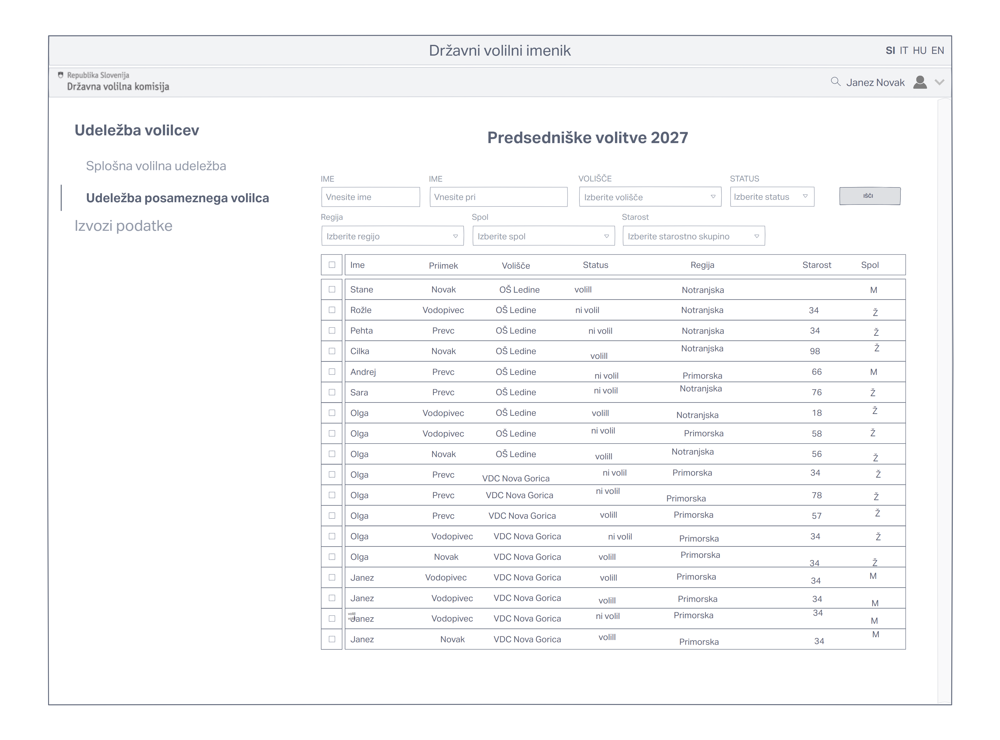

# :orange_square: Dokument zahtev

|                             |                                                                   |
| :-------------------------- | :---------------------------------------------------------------- |
| **Naziv projekta**          | Informacijski sistem za podporo glasovanju (ISPG)                 |
| **Kraj in datum**           | Ljubljana, 26. 3. 2023                                            |

## Povzetek projekta

Opisani projekt zadeva transformacijo volilnega imenika iz tiskane oblike v digitalno, kar prinaša vrsto priložnosti in starih ter novih zahtev. Upoštevati mora osnovne funkcionalnosti obstoječega sistema, tj. predvsem zagotavljanje, da lahko na volitvah (bodisi na volišču, doma, v Sloveniji ali tujini) največ enkrat volijo le volilni upravičenci. Tiskani volilni imeniki se sestavljajo za vsake volitve in volišče posebej, to pa želimo razširiti tako, da bi lahko glasovali na kateremkoli volišču. Poleg tega sistem predstavlja podlago za odpravo potrdil, ki se izdajajo na delno ad hoc način v primerih, ko volilec ima volilno pravico, vendar se na volilnem imeniku ne nahaja, saj je ta ažuren le ob določenem trenutku. Sistem mora podpirati tudi glasovanje po pošti in vrsto drugih funkcionalnih in nefunkcionalnih zahtev, ki jih prinaša digitalizacija. Zato so potrebni natančno definirani pojmi in zahteve (vključno s tokovi izvajanja) ter primeri uporabe, pomagamo pa si tudi s prototipiranjem vmesnikov.

## 1. Uvod

Aplikacija, ki jo razvijamo modernizira, digitalizira in nadgradi obstoječi sistem beleženja volilne udeležbe, ki se trenutno izvaja s pomočjo natisnjenih volilnih imenikov. Ta je zelo omejujoč, saj ne omogoča volilcem, da volijo na kateremkoli volišču bi želeli. Poleg tega tudi ni ažuren in so zato potrebna posebna potrdila v primerih, kjer volilni imeniki še niso posobljeni, hkrati pa ne omogoča glasovanjem tistim, ki so po tiskanju imenika volilno pravico že izgubili. Naša rešitev seveda ohranja glavno funkcionalnost, torej ugotavljanje in preverjanje identitite volilca, preverjanje obstoja volilne pravice, preprečevanje večkratnega glasovanja in beleženje udeležbe. Digitalizacija ne le da odpravi prej naštete probleme, temveč z verigo blokov in dodatno revizijsko podatkovno bazo skrbi za večjo transparentnost volitev. V luči zasledovanja tega cilja je projekt tudi odprtokoden. Ker je tak sistem del kritične infrakstrukture mora biti tudi varen in dosegljiv, kar pomeni, da je ne le dostopen vsem volilnim komisijam in drugim uporabnikom sistema, temveč, da je tudi odporen na napade, ki bi sistem hoteli onesposobiti. Poleg tega pa mora projekt izpolnjevati zahtevam zakonodaje, tako s področja varnosti osebnih podatkov kot javnega naročanja.

Sistem mora biti prilagojen raznim razmeram v katerih se izvajajo volitve. Glasovanje lahko poteka v Sloveniji ali tujini, predčasno, na volišču (dodeljenem ali OMNIA), na domu oz. v domu za ostarele, v bolnišnici in seveda tudi po pošti. Volitve po pošti celoten proces naredijo bolj kompleksen, saj je potrebno spremljati tudi kdo je glasovnico po pošti že zahteval in če je ta morebiti že prišla nazaj. Poleg tega uvajamo novo možnost popravljanja že oddanega glasu po pošti tako, da se volilec vseeno zglasi na volišču, v tem primeru pa se glasovnica prispela po pošti zavrže, na kar pa mora sistem seveda opozoriti. Identifikacija in preverjanje istovetnosti z digitalizacijo osebnih dokumentov prav tako prinaša nove priložnosti, predvsem za transparentnost in racionalizacijo poslovnih procesov.

## 2. Uporabniške vloge

Za razlago kratic in drugih pojmov glej 3. poglavje (Slovar pojmov).

- **administrator**: upravljalec informacijskega sistema, ki tudi upravlja s člani DVK; to je lahko IT administrator DVK ali pa Državni zbor
- **član DVK**: upravlja s člani OVK in opazovalci volitev ter ima v volilnem imeniku vpogled v udeležbo posameznika
- **član OVK**: upravlja volišča in člane VO ter ima v volilnem imeniku vpogled v udeležbo posameznika; poleg tega skrbi tudi pošiljanje in prejemanje glasovnic po pošti
- **član VO**: oseba, ki zabeleži udeležbo (**vpisničar**) volilca na volitvah in ima v volilnem imeniku vpogled v udeležbo posameznika
- **opazovalec volitev**: sem spadajo akreditirani opazovalci volitev in člani VKVE ter imajo v volilnem imeniku vpogled v udeležbo posameznika
- **neprijavljen uporabnik**: splošna javnost in raziskovalci, ki dostopajo do teh vmesnikov preko drugih aplikacij (npr. za spremljanje rezultatov volitev v realnem času); njihov dostop je omejen do podatkov o splošni volilni udeležbi, razdeljeni po geografiji, starosti ali spolu (do katerih imajo dostop tudi drugi uporabniki razen administratorja)

Čeprav se vsi dogodki beleženja udeležbe pišejo na verigo blokov, vključno kdaj je posameznik bil zabeležen v volilnem imeniku, pa to ne pomeni, da lahko splošna javnost poveže te osebe z njihovo dejansko identiteto. Na verigo blokov se zapisujejo (psevdo)anononimni identifikatorji, ki pa jih lahko z realnimi identitetami volilcev lahko povežejo le uporabniki, katerim je v volilnem imeniku dovoljen vpogled v udeležbo posameznika. Le tako lahko preverijo, če je poljuben volilec zares glasoval.

## 3. Slovar pojmov

- **glasovanja**, kar vkljucuje tuid **volitve** in **referendume**: tu so mišljene posamezne ločene volitve, ki imajo svoje volilne upravičence in za katere se vodijo ločeni volilni imeniki; npr. pri volitvah v Državni zbor gre dejansko za 90 različnih volitev, saj se posebej (z vidika volilca) volijo poslanci na nivoju 88 volilnih okrajev ter 2 poslanca narodnih manjšin; prav tako se več referendumov izvedenih na isti dan smatrajo kot ločena glasovanja
- **volilec**: oseba, ki poskuša glasovati, četudi nima volilne pravice
- **volilna pravica**: pravica, ki odraža upravičenost do glasovanja (na referendumu ali na volitvah)

- **glasovnica**: listek, na katerega volilec napiše svojo odločitev ali mnenje; (izven tega dokumenta) tudi **volilnica**, **volilni listek** ali **glasovalni listek**
- **volilna karta**: dokument, ki se volilcu pošlje, če želi glasovati po pošti, na katerem so zapisani njegovi osebni podatki in lastnoročni podpis ter drugi podatki
- **volilni gradivo**: dokument, ki se volilcu pošlje, če želi glasovati po pošti, ki vključuje navodila, volilno karto, glasovnico in dve ovojnici

- **volišče**: mesto na katerem lahko volilec z volilno pravico glasuje; sem spadajo tako diplomatsko konzularna predstavništva kot tudi mesta, kjer lahko volilec voli predčasno
- **upravna enota**: urad na katerem lahko volilni upravičenec (med drugim) uredi glasovanje po pošti; sem spadajo tudi diplomatsko konzularna predstavništva, ki opravljajo iste naloge

- **api**: aplikacijski programski vmesnik, skupek protokolov in orodij za interakcijo in pridobitev podatkov med različnimi programskimi komponentami (interakcija med sistemom in zunanjimi viri)
- **rest**: arhitekturni stil spletnih storitev, temelji na protokolu HTTP. Vsi podatki, zahteve in odgovori se prenašajo prekot HTTP metod(GET, POST, PUT, DELETE)
- **csv**: vrednosti ločene z vejico, eden izmed običajnih tekstovnih formatov kodiranja pri tabelaričnih podatkih. 
- **TOTP**: enkratno geslo, ki velja le v krajšem časovnem intervalu. Generira ga posebna naprava na podlagi skrivnega ključa in trenutnega časa
- **json**: objektni zapis podatkov v prenosljivi tekstovni obliki, uporablja se predvsem na spletu zaradi preglednosti pri delu z njim
- **URL**: enoličen naslov spletnega mesta vira, vsebuje podatke o uporabljenem protokolu, domeni, poti do vira

### Organizacijska razdelitev

- **Državna volilna komisija (DVK)**: krovna volilna komisija, ki imenuje člane ostalih volilnih komisij (OVK in VKVO) in akreditira opazovalce volitev; volitev ne izvaja neposredno, jih pa nadzira in usmerja; imenovana je s strani Državnega zbora
- **Volilna komisija volilne enote (VKVO)**: volilna komisija, ki prav tako ne izvaja volitev neposredno, ampak jih nadzira; znotraj našega sistema je uporabniška vloga njihovih članov *opazovalec volitev*, saj opravljajo iste funkcionalnosti in jih prav tako imenuje DVK
- **Okrajna volilna komisija (OVK)**: določa volišča in območja volišč, imenuje volilne odbore, ugotavlja izid glasovanja v volilnem okraju, vodi neposredno tehnično delo v zvezi z volitvami, opravlja druge naloge, ki jih določa zakon (39. člen Zakona o volitvah v Državni zbor (ZVDZ))
- **Volilni odbor (VO)**: skupina oseb, ki na volišču dejansko izvaja volitve, tj. volilce poišče v imeniku, preveri njihovo istovetnost in upravičenost do glasovanja, zabeleži udeležbo in jim podeli glasovnico; na vsakem volišču je prisoten vsaj en volilni odbor
- **akreditirani opazovalec volitev**: oseba, akreditirana s strani DVK, da lahko spremlja potek volitev in tako pripomore k transparentnosti in legitimnosti le teh

### Zbirke podatkov

- **register fizičnih oseb**: podatkovna baza, ki vsebuje osnovne podatke o vseh fizičnih osebah s katerimi ima opravka država
- **evidenca volilne pravice**: evidenca, ki vsebuje podatke o volilni pravici posameznih oseb, vključno z odvzemom volilne pravice
- **volilni imenik**: zbirka podatkov, ki se vodi za posamezno glasovanje, v katero se zapisujejo podatki o volilni udeležbi in glasovnicah poslanih po pošti

- **transakcijska podatkovna baza (TPB)**: podatkovna baza z ažurnimi podatki o dejanski udeležbi
- **revizijska podatkovna baza (RPB)**: podatkovna baza oz. podatkovno skladišče, ki kot črna škatljica beleži vse dogodke v sistemu

## 4. Diagram primerov uporabe

Spodaj je predstavljen diagram primerov uporabe našega informacijskega sistema.

![DPU](https://teaching.lavbic.net/plantuml/png/dLVDRkCs43wldeBOIzg35v6b-AS80copBR0eK1dTZGzjSw2bYKDR9WrAqMxJzWsQXyYBz9IyLuUKAP4I1ISr4iFyEDzm_ZWZvN1Jab8GoTQt9ScOXBHaWWV5bl4zbNH7SiQX_6CFHCZoLWG1JKiXoTltsOvnLfIIul8jeGMX2Z7RJ__ab9CFov_qrWvsAv2uShSJPplfRYyJQtUPcCraJ-z5HND8IILoLaAbnSIg05c1D68_mrwo3Qto3N1ojnUIhZZRrfPozD38NG979tBEY8GrEWIIx2Mi69vGb1NLX5JkZVWF5Sk0frIVpG5bQSLIq69GDM9Bm8XIiih5LjJshLAp1rUAL6k6AuCknFDZoIafSDKujVWK12ebbAzpmCDps9PISCoEFbzPpNQW_FepU7DNG4eB5Fljnt5uJNxHxaYQOXJ8qmD6L5HDHgukmu3WvwGXlT-MwFE0yBWZ_06eNrnBHntfXIX4HbVvXl8DHWn_bnWL8ceckxKEYZlKxoKhZhFED4j_sK4OTu8W3fMJGkMKpjNbfCUDheaLaM7cjCUChuaJdc7kxALnQbIWrwwA-IlYTRXFcFfJRxpE1cecQMicx78cJfWyZ76NCUs4nyDvTVrOtDSKa4NpLz1i829j97k5C_S6f2NqwYKy7GX8ovczDXujzN_LnzXV7zXJ5hgbKYEdoi5fEuq4mQO9icGtR8i3OcS8umuXiWctL6PVg0ISHrlWBIdga6ARz3dvl322SSzYD3d9R8jrdjM_OpQcGFVaGqIV7zcDfBoic_ppuzE3eK-2DrOJn13M12D6MxaNPimmxmnpQf_GPAjtmCoV8RnSQewmmq7hd1QYuZYVVkVVtDF3-c03_k74OTyQbVDEc4EiVdGHTBjnLOaLpZrMY9ABeZIZ273UYMo5WzQeZ4vx1ivLxc03ErSXMjFOTjUtBGezxdx4ELmNcBusseZK12Zgz1qy59yDwgZWVHOLsBQtDBVMRDQTdlHF3r3pCilYXXqRCriLlz8LvF3yBsWTcVwz0aEOEB8VxrL1eU-bp5YEqRI2OXZJmn5Efl3UBVS27n4oKf5YdsFmk3YaHJId2gDZrirqz3A-IimQn5hI6xPXHbklRkANQols8ZUknQTTHMUlK5HIgV9YT7KxKpYnTTdKWkxWNXUlMmhnEFWR7nBLGoqPZJBnXOykz6FJIGyRUx38WyKUx2m8cgTZ6v_uuQaVdWKdNdm-WECJW5yHJdW_FXx0ew4Jug6DnkEaip4PmAS3UEDqTsC-i85pBL3F_WuM1kgBdFyr6jKJobb6xZ9k2g8cdpbHSR74WoqJ2p9lB1RaznJ7oO13qw6DsP2gkMr9MwsdVd5il2e0S_9EVHJyJiDZyjtvEUDfZZVfui8h4XqNYLsHGDbnzAI-I7HS93ukCl68dDVxwgDxBr4oyBK4dXti3O_R6nwtDpnkRtZ4ta2pT2Mfrz1sfTvT0oslb_WQ6gZcHivngLu_svvKVoxg2U7KTGTDl6XTsmRh5ZT2XwjdbigecRvP-cxX7741d0ST8BIDlQXxTE_-DLZYmThxXr3NH8G2k6fkupnOVAgZf1R_0G00)

**Diagram primerov uporabe** (izvorna koda :bar_chart: [PlantUML](../gradivo/plantuml/zajem-zahtev/DPU.puml))

Extension point pri << extend >> se sproži, ko volilec zahteva potrdilo o glasovanju.

## 5. Funkcionalne zahteve

Spodaj so predstavljene posamezne funkcionalne zahteve s pripadajočim osnovnim ter alternativnimi tokovi.

### Prijava

#### Akterji

- neprijavljen uporabnik

#### Povzetek funkcionalnosti

Neprijavljen uporabnik (ki pa je že registriran) se lahko prijavi v informacijski sistem.

#### Osnovni tok
**Prijava s certifikatom**
1. Ob obisku začetne strani informacijskega sistema neprijavljen uporabnik klikne gumb z nazivom "prijava".
2. Odpre se stran za prijavo v sistem.
3. Neprijavljen uporabnik izbere možnost prijave s certifikatom.
4. V brskalniku se odpre novo okno, za izbiro certifikata.
5. Neprijavljen uporabnik potrdi izbiro certifikata.
6. Če je certifikat ustrezen je uporabnik vpisan v sistem in preusmerjen na osnovno stran informacijskega sistema.

#### Alternativni tok(ovi)
**Prijava s hardware tokenom**
1. Ob obisku začetne strani informacijskega sistema neprijavljen uporabnik klikne gumb z nazivom "prijava".
2. Odpre se stran za prijavo v sistem.
3. Neprijavljen uporabnik izbere možnost prijave s hardware tokenom.
4. V brskalniku se odpre okno, ki pozove neprijavljenega uporabnika, da vstavi svoj hardware token.
5. Neprijavljen uporabnik vstavi hardware token, ki je posredovan brskalniku
6. Če je posredovani token ustrezen je uporabnik vpisan v sistem in preusmerjen na osnovno stran informacijskega sistema.

**Prijava s TOTP**
1. Ob obisku začetne strani informacijskega sistema neprijavljen uporabnik klikne gumb z nazivom "prijava".
2. Odpre se stran za prijavo v sistem.
3. Neprijavljen uporabnik izbere možnost prijave s TOTP.
4. Neprijavljen uporabnik vpiše svoje uporabniško ime in geslo.
5. Enkratno geslo je posredovano na uporabnikovo TOTP napravo (mobilni telefon).
6. Neprijavljen uporabnik vpiše enkratno geslo.
7. Če so uporabniško ime, geslo in enkratno geslo ustrezni je uporabnik vpisan v sistem in preusmerjen na osnovno stran informacijskega sistema.

#### Izjemni tok(ovi)
**Neveljaven certifikat**\
Neprijavljen uporabnik se ne more prijaviti, ker izbran certifikat ni veljaven. Sistem prikaže obvestilo o napaki in ponudi možnost ponovne prijave.

**Certifikata ni v brskalniku**\
Neprijavljen uporabnik se ne more prijaviti, ker v brskalniku ni ponujen noben certifikat. Sistem prikaže obvestilo o napaki in ponudi možnost ponovne prijave. 

**Neveljaven hardware token**\
Neprijavljen uporabnik se ne more prijaviti, ker vstavljen hardware token ni veljaven. Sistem prikaže obvestilo o napaki in ponudi možnost ponovne prijave.

**Hardware token ni zaznan**\
Neprijavljen uporabnik se ne more prijaviti, ker vstavljen hardware token ni zaznan. Sistem prikaže obvestilo o napaki in ponudi možnost ponovne prijave.

**Napačno uporabniško ime ali geslo**\
Neprijavljen uporabnik se ne more prijaviti, ker vpisano uporabniško ime in geslo ni pravilno. Sistem prikaže obvestilo o napaki in ponudi možnost ponovne prijave.

**Napačno enkratno geslo**\
Neprijavljen uporabnik se ne more prijaviti, ker vpisano enkratno geslo ni pravilno. Sistem prikaže obvestilo o napaki in ponudi možnost ponovne prijave.

#### Pogoji
- Neprijavljen uporabnik je predhodno registriran v sistem.

#### Posledice
- Neprijavljen uporabnik postane prijavljen uporabnik (član DVK ali član okrajne volilne komisije ali opazovalec volitev ali član volilnega odbora).

#### Posebnosti
- Ni posebnosti.

#### Prioritete identificiranih funkcionalnosti
Must have.

#### Pogostost uporabe:
- Ves čas v času volitev.

#### Sprejemni testi
| Primer uporabe | Funkcijo, ki se testira | Začetno stanje sistema | Vhod | Pričakovan rezultat |
| -------- | -------- | -------- | -------- | -------- |
| Prijava s certifikatom | Prijava z veljavnim certifikatom | Neprijavljen uporabnik je izbral možnost prijave s certifikatom | V oknu brskalnika izberemo veljaven certifikat in potrdimo izbiro | Neprijavljen uporabnik je sedaj prijavljen v sistem, preusmeritev na osnovno stran sistema |
| Prijava s certifikatom | Prijava z neveljavnim certifikatom | Neprijavljen uporabnik je izbral možnost prijave s certifikatom | V oknu brskalnika izberemo neveljaven certifikat in potrdimo izbiro | Sistem javi napako, da je certifikat neveljaven, neprijavljen uporabnik ima možnost ponovne prijave v sistem |
| Prijava s certifikatom | Certifikata ni v brskalniku | Neprijavljen uporabnik je izbral možnost prijave s certifikatom | V oknu brskalnika certifikat ni prisoten | Neprijavljen uporabnik ima možnost ponovne prijave v sistem |
| Prijava s hardware tokenom | Prijava z veljavnim hardware tokenom | Neprijavljen uporabnik je izbral možnost prijave s hardware tokenom | Veljaven hardware token je posredovan sistemu | Neprijavljen uporabnik je sedaj prijavljen v sistem, preusmeritev na osnovno stran sistema |
| Prijava s hardware tokenom | Prijava z neveljavnim hardware tokenom | Neprijavljen uporabnik je izbral možnost prijave s hardware tokenom | Neveljaven hardware token je posredovan sistemu | Sistem javi napako, da je hardware token neveljaven, neprijavljen uporabnik ima možnost ponovne prijave v sistem |
|Prijava s hardware tokenom | Hardware token ni zaznan | Neprijavljen uporabnik je izbral možnost prijave s hardware tokenom | Hardware token ni zaznan | Neprijavljen uporabnik ima možnost ponovne prijave v sistem |
| Prijava s TOTP | Prijava z veljavnimi TOTP podatki | Neprijavljen uporabnik je izbral možnost prijave s TOTP | Neprijavljen uporabnik je vpisal veljavno uporabniško ime, geslo in enkratno geslo | Neprijavljen uporabnik je sedaj prijavljen v sistem, preusmeritev na osnovno stran sistema |
| Prijava s TOTP | Napačno uporabniško ime ali geslo | Neprijavljen uporabnik je izbral možnost prijave s TOTP | Neprijavljen uporabnik je vpisal veljavno enkratno geslo, ter napačno uporabniško ime ali geslo | Sistem javi napako, da prijavni podatki neveljavni, neprijavljen uporabnik ima možnost ponovne prijave v sistem |
| Prijava s TOTP | Napačno enkratno geslo | Neprijavljen uporabnik je izbral možnost prijave s TOTP | Neprijavljen uporabnik je vpisal veljavno uporabniško ime in geslo, ter neveljavno enkratno geslo | Sistem javi napako, da prijavni podatki neveljavni, neprijavljen uporabnik ima možnost ponovne prijave v sistem |

---


### Registracija članov DVK

#### Akterji:
- administrator

#### Povzetek funkcionalnosti:
Administrator lahko v sistem doda novega uporabnika z vlogo član DVK.

#### Osnovni tok
**Registracija članov DVK preko obrazca na strani**
1. Administrator klikne na zavihek uporabniki -> člani DVK.
2. Odpre se stran za upravljanje, brisanje in dodajanje računov članov DVK.
3. Administrator izbere možnost dodajanja novih članov DVK.
4. Administrator izbere možnost dodajanja novih članov DVK preko obrazca na strani.
5. Odpre se obrazec za dodajanje novega člana DVK.
6. Administrator izpolni vse zahtevane podatke obrazca.
7. Administrator pregleda izpolnjen obrazec in potrdi svojo izbiro.

#### Alternativni tok(ovi)
**Registracija članov DVK preko obstoječe CSV datoteke**
1. Administrator klikne na zavihek uporabniki -> člani DVK.
2. Odpre se stran za upravljanje, brisanje in dodajanje računov članov DVK.
3. Administrator izbere možnost dodajanja novih članov DVK.
4. Administrator izbere možnost dodajanja novih članov DVK preko obstoječe CSV datoteke.
5. Odpre se stran z možnostjo nalaganja CSV datoteke z vnaprej definiranimi vrsticami.
6. Administrator naloži ustrezno CSV datoteko.
7. Sistem glede na vsebino CSV datoteke samodejno izpolni obrazec za dodajanje novega člana DVK.
8. Administrator pregleda izpolnjen obrazec in potrdi svojo izbiro.

#### Izjemni tok(ovi)
**Neveljavno izpolnjen obrazec na strani**\
Administrator napačno izpolni obrazec za dodajanje novega člana DVK. Sistem prikaže obvestilo o napaki in mesto napake, ter ponudi možnost popravka napake in ponovne oddaje obrazca.

**Neveljavna CSV datoteka za dodajanje novih članov DVK**\
Administrator naloži CSV datoteko, ki nima ustreznih vnaprej definiranih vrstic oz. so le te napačno izpolnjene. Sistem prikaže obvestilo o napaki in mesto napake, ter ponudi možnost popravka napake in ponovnega nalaganja popravljene CSV datoteke.

#### Pogoji
- Uporabnik, ki izvaja to akcijo je administrator.
- Novo dodani uporabnik, ni že obstoječi član DVK.

#### Posledice
- Med člani DVK je naveden novo dodani uporabnik.
- Novi član dobi obvestilo možnosti prijave in uporabe sistema.
- Novi član se lahko v sistem prijavi z vlogo člana DVK.

#### Posebnosti
- Ni posebnosti.

#### Prioritete identificiranih funkcionalnosti
Must have.

#### Pogostost uporabe:
- Redko, pred volitvami.

#### Sprejemni testi
| Primer uporabe | Funkcijo, ki se testira | Začetno stanje sistema | Vhod | Pričakovan rezultat |
| -------- | -------- | -------- | -------- | -------- |
| Registracija članov DVK preko obrazca na strani | Registracija članov DVK preko pravilno izpolnjenega obrazca na strani | Administrator je izbral možnost dodajanja novega člana DVK preko obrazca na spletni strani | Administrator izpolni obrazec za dodajanje novega člana DVK z ustreznimi podatki | Novo dodani uporabnik je obveščen o registraciji, sistem sporoči, da je bila akcija uspešna. Administrator je preusmerjen nazaj na pregled vseh članov DVK, med katerimi je tudi novo dodani uporabnik. |
| Registracija članov DVK preko obrazca na strani |  Registracija članov DVK preko pravilno izpolnjenega obrazca na strani |  Administrator je izbral možnost dodajanja novega člana DVK preko obrazca na spletni strani | Administrator izpolni obrazec za dodajanje novega člana DVK z neustreznimi podatki | Sistem javi napako. Administrator ostane na strani obrazca za dodajanje novega člana DVK, kjer so označena polja, ki jih je potrebno popraviti. |
| Registracija članov DVK preko obstoječe CSV datoteke | Registracija članov DVK preko obstoječe CSV datoteke, ki je pravilne strukture in je pravilno izpolnjena |  Administrator je izbral možnost dodajanja novega člana DVK preko dodajanje obstoječe CSV datoteke | Administrator naloži popoln CSV dokument za dodajanje novega člana DVK z ustreznimi podatki | Novo dodani uporabnik je obveščen o registraciji, sistem sporoči, da je bila akcija uspešna. Administrator je preusmerjen nazaj na pregled vseh članov DVK, med katerimi je tudi novo dodani uporabnik. |
| Registracija članov DVK preko obstoječe CSV datoteke | Registracija članov DVK preko obstoječe CSV datoteke, ki je napačne strukture ali pa je narobe izpolnjena | Administrator je izbral možnost dodajanja novega člana DVK preko dodajanje obstoječe CSV datoteke | Administrator naloži nepopoln CSV dokument za dodajanje novega člana DVK z neustreznimi podatki | Sistem javi napako. Administrator ostane na strani za dodajanje CSV datoteke za dodajanje novega člana DVK, kjer so navedena polja, ki jih je potrebno popraviti/dodati. |

---


### Registracija članov okrajnih volilnih komisij

#### Akterji:
- član DVK

#### Povzetek funkcionalnosti:
član DVK v sistem lahko doda novega uporabnika z vlogo član okrajne volilne komisije.

#### Osnovni tok
**Registracija članov okrajnih volilnih komisij preko obrazca na strani**
1. Član DVK klikne na zavihek uporabniki -> člani okrajne volilne komisije.
2. Odpre se stran za upravljanje, brisanje in dodajanje računov članov okrajne volilne komisije.
3. Član DVK izbere možnost dodajanja novih članov okrajne volilne komisije.
4. Član DVK izbere možnost dodajanja novih članov okrajne volilne komisije preko obrazca na strani.
5. Odpre se obrazec za dodajanje novega člana okrajne volilne komisije.
6. Član DVK izpolni vse zahtevane podatke obrazca.
7. Član DVK pregleda izpolnjen obrazec in potrdi svojo izbiro.

#### Alternativni tok(ovi)
**Registracija članov okrajnih volilnih komisij preko obstoječe CSV datoteke**
1. Član DVK klikne na zavihek uporabniki -> člani okrajne volilne komisije.
2. Odpre se stran za upravljanje, brisanje in dodajanje računov članov okrajne volilne komisije.
3. Član DVK izbere možnost dodajanja novih članov okrajne volilne komisije.
4. Član DVK izbere možnost dodajanja novih članov okrajne volilne komisije preko obstoječe CSV datoteke.
5. Odpre se stran z možnostjo nalaganja CSV datoteke z vnaprej definiranimi vrsticami.
6. Član DVK naloži ustrezno CSV datoteko.
7. Sistem glede na vsebino CSV datoteke samodejno izpolni obrazec za dodajanje novega člana okrajne volilne komisije.
8. Član DVK pregleda izpolnjen obrazec in potrdi svojo izbiro.

#### Izjemni tok(ovi)
**Neveljavno izpolnjen obrazec na strani**\
Član DVK napačno izpolni obrazec za dodajanje novega člana okrajne volilne komisije. Sistem prikaže obvestilo o napaki in mesto napake, ter ponudi možnost popravka napake in ponovne oddaje obrazca.

**Neveljavna CSV datoteka za dodajanje novih članov okrajnih volilnih komisij**\
Član DVK naloži CSV datoteko, ki nima ustreznih vnaprej definiranih vrstic oz. so le te napačno izpolnjene. Sistem prikaže obvestilo o napaki in mesto napake, ter ponudi možnost popravka napake in ponovnega nalaganja popravljene CSV datoteke.

#### Pogoji
- Uporabnik, ki izvaja to akcijo je član DVK.
- Novo dodani uporabnik, ni že obstoječi član okrajne volilne komisije.

#### Posledice
- Med člani okrajne volilne komisije je naveden novo dodani uporabnik.
- Novi član dobi obvestilo možnosti prijave in uporabe sistema.
- Novi član se lahko v sistem prijavi z vlogo člana okrajne volilne komisije.

#### Posebnosti
- Ni posebnosti.

#### Prioritete identificiranih funkcionalnosti
Must have.

#### Pogostost uporabe:
- Redko, pred volitvami.

#### Sprejemni testi
| Primer uporabe | Funkcijo, ki se testira | Začetno stanje sistema | Vhod | Pričakovan rezultat |
| -------- | -------- | -------- | -------- | -------- |
| Registracija članov okrajnih volilnih komisij preko obrazca na strani | Registracija članov okrajnih volilnih komisij preko pravilno izpolnjenega obrazca na strani | Član DVK je izbral možnost dodajanja novega člana okrajne volilne komisije preko obrazca na spletni strani | Član DVK izpolni obrazec za dodajanje novega člana okrajne volilne komisije z ustreznimi podatki | Novo dodani uporabnik je obveščen o registraciji, sistem sporoči, da je bila akcija uspešna. Član DVK je preusmerjen nazaj na pregled vseh članov okrajne volilne komisije, med katerimi je tudi novo dodani uporabnik. |
| Registracija članov okrajnih volilnih komisij preko obrazca na strani |  Registracija članov okrajnih volilnih komisij preko pravilno izpolnjenega obrazca na strani |  Član DVK je izbral možnost dodajanja novega člana okrajne volilne komisije preko obrazca na spletni strani | Član DVK izpolni obrazec za dodajanje novega člana okrajne volilne komisije z neustreznimi podatki | Sistem javi napako. Član DVK ostane na strani obrazca za dodajanje novega člana okrajne volilne komisije, kjer so označena polja, ki jih je potrebno popraviti. |
| Registracija članov okrajnih volilnih komisij preko obstoječe CSV datoteke | Registracija članov okrajnih volilnih komisij preko obstoječe CSV datoteke, ki je pravilne strukture in je pravilno izpolnjena |  Član DVK je izbral možnost dodajanja novega člana okrajne volilne komisije preko dodajanje obstoječe CSV datoteke | Član DVK naloži popoln CSV dokument za dodajanje novega člana okrajne volilne komisije z ustreznimi podatki | Novo dodani uporabnik je obveščen o registraciji, sistem sporoči, da je bila akcija uspešna. Član DVK je preusmerjen nazaj na pregled vseh članov okrajne volilne komisije, med katerimi je tudi novo dodani uporabnik. |
| Registracija članov okrajnih volilnih komisij preko obstoječe CSV datoteke | Registracija članov okrajnih volilnih komisij preko obstoječe CSV datoteke, ki je napačne strukture ali pa je narobe izpolnjena | Član DVK je izbral možnost dodajanja novega člana okrajne volilne komisije preko dodajanje obstoječe CSV datoteke | Član DVK naloži nepopoln CSV dokument za dodajanje novega člana okrajne volilne komisije z neustreznimi podatki | Sistem javi napako. Član DVK ostane na strani za dodajanje CSV datoteke za dodajanje novega člana okrajne volilne komisije, kjer so navedena polja, ki jih je potrebno popraviti/dodati. |

---


### Deaktivacija računa članov okrajnih volilnih komisij

#### Akterji:
- član DVK

#### Povzetek funkcionalnosti:
Član DVK lahko zaradi upravičenega razloga (menjava članov, zloraba pooblastil, ...) deaktivira račun uporabnika z vlogo član okrajne volilne komisije.

#### Osnovni tok
1. Član DVK klikne na zavihek uporabniki -> člani okrajne volilne komisije.
2. Odpre se stran za upravljanje, brisanje in dodajanje računov članov okrajne volilne komisije.
3. Član DVK s klikom nanj izbere račun člana okrajne volilne komisije.
4. Odpre se stran s podrobnostmi in podatki o računu člana okrajne volilne komisije.
5. Član DVK izbere možnost deaktivacije računa člana okrajne volilne komisije.
6. Član DVK potrdi svojo odličitev deaktivacije izbranega računa.

#### Alternativni tok(ovi)
Ni alternativnih tokov.

#### Izjemni tok(ovi)
Ni izjemnih tokov.

#### Pogoji
- Uporabnik, ki izvaja to akcijo je član DVK.
- Uporabnik katerega račun želi član DVK deaktivirati ima trenutno aktiven račun z vlogo član okrajne volilne komisije.

#### Posledice
- Med člani okrajne volilne komisije je uporabnik, katerega račun je bil deaktiviran še vedno naveden, vendar med podrobnostmi piše, da je račun deaktiviran, ter pojavi se možnost ponovne aktivacije računa.
- Uporabnik, katerega račun je bil deaktiviran nima več dostopa do računa - se ne more več prijaviti v sistem z vlogo člana okrajne volilne komisije.

#### Posebnosti
- Ni posebnosti.

#### Prioritete identificiranih funkcionalnosti
Must have.

#### Pogostost uporabe:
- Redko.

#### Sprejemni testi
| Primer uporabe | Funkcijo, ki se testira | Začetno stanje sistema | Vhod | Pričakovan rezultat |
| -------- | -------- | -------- | -------- | -------- |
| Deaktivacija računa članov okrajnih volilnih komisij | Deaktivacija aktiviranega računa članov okrajnih volilnih komisij | Član DVK je izbral račun aktiviranega člana okrajnih volilnih komisij. | Članu DVK je viden gumb za deaktivacijo računa člana okrajnih volilnih komisij. Član DVK pritisne ta gumb in potrdi svojo izbiro | Račun izbranega člana okrajnih volilnih komisij je postal deaktiviran. Član DVK je preusmerjen nazaj na seznam računov vseh članov okrajnih volilnih komisij. |
| Deaktivacija računa članov okrajnih volilnih komisij | Deaktivacija že deaktiviranega računa članov okrajnih volilnih komisij |  Član DVK je izbral račun deaktiviranega člana okrajnih volilnih komisij. | Članu DVK ni viden gumb za deaktivacijo računa člana okrajnih volilnih komisij. | Račun izbranega člana okrajnih volilnih komisij je že deaktiviran. |

---

### Aktivacija računa članov okrajnih volilnih komisij

#### Akterji:
- član DVK

#### Povzetek funkcionalnosti:
Član DVK lahko aktivira račun uporabnika z vlogo član okrajne volilne komisije.

#### Osnovni tok
1. Član DVK klikne na zavihek uporabniki -> člani okrajne volilne komisije.
2. Odpre se stran za upravljanje, brisanje in dodajanje računov članov okrajne volilne komisije.
3. Član DVK s klikom nanj izbere račun člana okrajne volilne komisije.
4. Odpre se stran s podrobnostmi in podatki o računu člana okrajne volilne komisije.
5. Član DVK izbere možnost aktivacije računa člana okrajne volilne komisije.
6. Član DVK potrdi svojo odličitev aktivacije izbranega računa.

#### Alternativni tok(ovi)
Ni alternativnih tokov.

#### Izjemni tok(ovi)
Ni izjemnih tokov.

#### Pogoji
- Uporabnik, ki izvaja to akcijo je član DVK.
- Uporabnik katerega račun želi član DVK aktivirati ima trenutno deaktiviran račun z vlogo član okrajne volilne komisije.

#### Posledice
- Med člani okrajne volilne komisije je uporabnik, katerega račun je bil aktiviran še vedno naveden, vendar med podrobnostmi piše, da je račun aktiviran, ter pojavi se možnost deaktivacije računa.
- Uporabnik, katerega račun je bil aktiviran je o tej akciji obveščen.
- Uporabnik, katerega račun je bil aktiviran ima ponovno možnost dostopa do računa - ponovno se lahko prijavi v sistem z vlogo člana okrajne volilne komisije.

#### Posebnosti
- Ni posebnosti.

#### Prioritete identificiranih funkcionalnosti
Must have.

#### Pogostost uporabe:
- Redko.

#### Sprejemni testi
| Primer uporabe | Funkcijo, ki se testira | Začetno stanje sistema | Vhod | Pričakovan rezultat |
| -------- | -------- | -------- | -------- | -------- |
| Aktivacija računa članov okrajnih volilnih komisij | Aktivacija deaktiviranega računa članov okrajnih volilnih komisij | Član DVK je izbral račun deaktiviranega člana okrajnih volilnih komisij. | Članu DVK je viden gumb za aktivacijo računa člana okrajnih volilnih komisij. Član DVK pritisne ta gumb in potrdi svojo izbiro | Račun izbranega člana okrajnih volilnih komisij je postal aktiviran. Član DVK je preusmerjen nazaj na seznam računov vseh članov okrajnih volilnih komisij. |
| Aktivacija računa članov okrajnih volilnih komisij | Aktivacija že aktiviranega računa članov okrajnih volilnih komisij |  Član DVK je izbral račun aktiviranega člana okrajnih volilnih komisij. | Članu DVK ni viden gumb za aktivacijo računa člana okrajnih volilnih komisij. | Račun izbranega člana okrajnih volilnih komisij je že aktiviran. |

---

### Registracija članov volilnega odbora

#### Akterji:
- član okrajne volilne komisije

#### Povzetek funkcionalnosti:
Član okrajne volilne komisije lahko v sistem doda novega uporabnika z vlogo član volilnega odbora.

#### Osnovni tok
**Registracija članov volilnega odbora preko obrazca na strani**
1. Član okrajne volilne komisije klikne na zavihek uporabniki -> člani volilnega odbora.
2. Odpre se stran za upravljanje, brisanje in dodajanje računov članov volilnega odbora.
3. Član okrajne volilne komisije izbere možnost dodajanja novih članov volilnega odbora.
4. Član okrajne volilne komisije izbere možnost dodajanja novih članov volilnega odbora preko obrazca na strani.
5. Odpre se obrazec za dodajanje novega člana volilnega odbora.
6. Član okrajne volilne komisije izpolni vse zahtevane podatke obrazca.
7. Član okrajne volilne komisije pregleda izpolnjen obrazec in potrdi svojo izbiro.

#### Alternativni tok(ovi)
**Registracija članov volilnega odbora preko obstoječe CSV datoteke**
1. Član okrajne volilne komisije klikne na zavihek uporabniki -> člani volilnega odbora.
2. Odpre se stran za upravljanje, brisanje in dodajanje računov članov volilnega odbora.
3. Član okrajne volilne komisije izbere možnost dodajanja novih članov volilnega odbora.
4. Član okrajne volilne komisije izbere možnost dodajanja novih članov volilnega odbora preko obstoječe CSV datoteke.
5. Odpre se stran z možnostjo nalaganja CSV datoteke z vnaprej definiranimi vrsticami.
6. Član okrajne volilne komisije naloži ustrezno CSV datoteko.
7. Sistem glede na vsebino CSV datoteke samodejno izpolni obrazec za dodajanje novega člana volilnega odbora.
8. Član okrajne volilne komisije pregleda izpolnjen obrazec in potrdi svojo izbiro.

#### Izjemni tok(ovi)
**Neveljavno izpolnjen obrazec na strani**\
Član okrajne volilne komisije napačno izpolni obrazec za dodajanje novega člana volilnega odbora. Sistem prikaže obvestilo o napaki in mesto napake, ter ponudi možnost popravka napake in ponovne oddaje obrazca.

**Neveljavna CSV datoteka za dodajanje novih članov volilnega odbora**\
Član okrajne volilne komisije naloži CSV datoteko, ki nima ustreznih vnaprej definiranih vrstic oz. so le te napačno izpolnjene. Sistem prikaže obvestilo o napaki in mesto napake, ter ponudi možnost popravka napake in ponovnega nalaganja popravljene CSV datoteke.

#### Pogoji
- Uporabnik, ki izvaja to akcijo je Član okrajne volilne komisije.
- Novo dodani uporabnik, ni že obstoječi član volilnega odbora.

#### Posledice
- Med člani volilnega odbora je naveden novo dodani uporabnik.
- Novi član dobi obvestilo možnosti prijave in uporabe sistema.
- Novi član se lahko v sistem prijavi z vlogo člana volilnega odbora.

#### Posebnosti
- Ni posebnosti.

#### Prioritete identificiranih funkcionalnosti
Must have.

#### Pogostost uporabe:
- Redko, pred volitvami.

#### Sprejemni testi
| Primer uporabe | Funkcijo, ki se testira | Začetno stanje sistema | Vhod | Pričakovan rezultat |
| -------- | -------- | -------- | -------- | -------- |
| Registracija članov volilnega odbora preko obrazca na strani | Registracija članov volilnega odbora preko pravilno izpolnjenega obrazca na strani | Član okrajne volilne komisije je izbral možnost dodajanja novega člana volilnega odbora preko obrazca na spletni strani | Član okrajne volilne komisije izpolni obrazec za dodajanje novega člana volilnega odbora z ustreznimi podatki | Novo dodani uporabnik je obveščen o registraciji, sistem sporoči, da je bila akcija uspešna. Član okrajne volilne komisije je preusmerjen nazaj na pregled vseh članov volilnega odbora, med katerimi je tudi novo dodani uporabnik. |
| Registracija članov volilnega odbora preko obrazca na strani |  Registracija članov volilnega odbora preko pravilno izpolnjenega obrazca na strani |  Član okrajne volilne komisije je izbral možnost dodajanja novega člana volilnega odbora preko obrazca na spletni strani | Član okrajne volilne komisije izpolni obrazec za dodajanje novega člana volilnega odbora z ustreznimi podatki | Sistem javi napako. Član okrajne volilne komisije ostane na strani obrazca za dodajanje novega člana volilnega odbora, kjer so označena polja, ki jih je potrebno popraviti. |
| Registracija članov volilnega odbora preko obstoječe CSV datoteke | Registracija članov volilnega odbora preko obstoječe CSV datoteke, ki je pravilne strukture in je pravilno izpolnjena |  Član okrajne volilne komisije je izbral možnost dodajanja novega člana okrajne volilne komisije preko dodajanje obstoječe CSV datoteke | Član okrajne volilne komisije naloži popoln CSV dokument za dodajanje novega člana volilnega odbora z ustreznimi podatki | Novo dodani uporabnik je obveščen o registraciji, sistem sporoči, da je bila akcija uspešna. Član okrajne volilne komisije je preusmerjen nazaj na pregled vseh članov volilnega odbora, med katerimi je tudi novo dodani uporabnik. |
| Registracija članov volilnega odbora preko obstoječe CSV datoteke | Registracija članov okrajnih volilnih komisij preko obstoječe CSV datoteke, ki je napačne strukture ali pa je narobe izpolnjena | Član okrajne volilne komisije je izbral možnost dodajanja novega člana okrajne volilne komisije preko dodajanje obstoječe CSV datoteke | Član okrajne volilne komisije naloži nepopoln CSV dokument za dodajanje novega člana volilnega odbora z neustreznimi podatki | Sistem javi napako. Član okrajne volilne komisije ostane na strani za dodajanje CSV datoteke za dodajanje novega člana okrajne volilne komisije, kjer so navedena polja, ki jih je potrebno popraviti/dodati. |

---

### Deaktivacija računa članov volilnega odbora

#### Akterji:
- član okrajne volilne komisije

#### Povzetek funkcionalnosti:
Član okrajne volilne komisije lahko iz upravičenega razloga (menjava članov, zloraba pooblastil, ...) deaktivira račun uporabnika z vlogo član volilnega odbora.

#### Osnovni tok
1. Član okrajne volilne komisije klikne na zavihek uporabniki -> člani volilnega odbora.
2. Odpre se stran za upravljanje, brisanje in dodajanje računov članov volilnega odbora.
3. Član okrajne volilne komisije s klikom nanj izbere račun člana volilnega odbora.
4. Odpre se stran s podrobnostmi in podatki o računu člana volilnega odbora.
5. Član okrajne volilne komisije izbere možnost deaktivacije računa člana volilnega odbora.
6. Član okrajne volilne komisije potrdi svojo odličitev deaktivacije izbranega računa.

#### Alternativni tok(ovi)
Ni alternativnih tokov.

#### Izjemni tok(ovi)
Ni izjemnih tokov.

#### Pogoji
- Uporabnik, ki izvaja to akcijo je član okrajne volilne komisije.
- Uporabnik katerega račun želi član okrajne volilne komisije deaktivirati ima trenutno aktiven račun z vlogo član volilnega odbora.

#### Posledice
- Med člani volilnega odbora je uporabnik, katerega račun je bil deaktiviran še vedno naveden, vendar med podrobnostmi piše, da je račun deaktiviran, ter pojavi se možnost ponovne aktivacije računa.
- Uporabnik, katerega račun je bil deaktiviran nima več dostopa do računa - se ne more več prijaviti v sistem z vlogo člana volilnega odbora.

#### Posebnosti
- Ni posebnosti.

#### Prioritete identificiranih funkcionalnosti
Must have.

#### Pogostost uporabe:
- Redko.

#### Sprejemni testi
| Primer uporabe | Funkcijo, ki se testira | Začetno stanje sistema | Vhod | Pričakovan rezultat |
| -------- | -------- | -------- | -------- | -------- |
| Deaktivacija računa članov volilnega odbora | Deaktivacija aktiviranega računa članov volilnega odbora | Član okrajne volilne komisije je izbral račun aktiviranega člana volilnega odbora. | Članu okrajne volilne komisije je viden gumb za deaktivacijo računa člana volilnega odbora. Član okrajne volilne komisije pritisne ta gumb in potrdi svojo izbiro | Račun izbranega člana volilnega odbora je postal deaktiviran. Član okrajne volilne komisije je preusmerjen nazaj na seznam računov vseh članov volilnega odbora. |
| Deaktivacija računa članov volilnega odbora | Deaktivacija že deaktiviranega računa članov volilnega odbora |  Član okrajne volilne komisije je izbral račun deaktiviranega člana volilnega odbora. | Članu okrajne volilne komisije ni viden gumb za deaktivacijo računa člana volilnega odbora. | Račun izbranega člana volilnega odbora je že deaktiviran. |

---

### Aktivacija računa članov volilnega odbora

#### Akterji:
- član okrajne volilne komisije

#### Povzetek funkcionalnosti:
Član okrajne volilne komisije lahko aktivira račun uporabnika z vlogo član volilnega odbora.

#### Osnovni tok
1. Član okrajne volilne komisije klikne na zavihek uporabniki -> člani volilnega odbora.
2. Odpre se stran za upravljanje, brisanje in dodajanje računov članov volilnega odbora.
3. Član okrajne volilne komisije s klikom nanj izbere račun člana volilnega odbora.
4. Odpre se stran s podrobnostmi in podatki o računu člana volilnega odbora.
5. Član okrajne volilne komisije izbere možnost aktivacije računa člana volilnega odbora.
6. Član okrajne volilne komisije potrdi svojo odličitev aktivacije izbranega računa.

#### Alternativni tok(ovi)
Ni alternativnih tokov.

#### Izjemni tok(ovi)
Ni izjemnih tokov.

#### Pogoji
- Uporabnik, ki izvaja to akcijo je član okrajne volilne komisije.
- Uporabnik katerega račun želi član okrajne volilne komisije aktivirati ima trenutno deaktiviran račun z vlogo član volilnega odbora.

#### Posledice
- Med člani volilnega odbora je uporabnik, katerega račun je bil aktiviran še vedno naveden, vendar med podrobnostmi piše, da je račun aktiviran, ter pojavi se možnost ponovne deaktivacije računa.
- Uporabnik, katerega račun je bil aktiviran ima ponovno možnost dostopa do računa - ponovno se lahko prijavi v sistem z vlogo člana volilnega odbora.

#### Posebnosti
- Ni posebnosti.

#### Prioritete identificiranih funkcionalnosti
Must have.

#### Pogostost uporabe:
- Redko.

#### Sprejemni testi
| Primer uporabe | Funkcijo, ki se testira | Začetno stanje sistema | Vhod | Pričakovan rezultat |
| -------- | -------- | -------- | -------- | -------- |
| Aktivacija računa članov volilnega odbora | Aktivacija deaktiviranega računa članov volilnega odbora | Član okrajne volilne komisije je izbral račun deaktiviranega člana volilnega odbora. | Članu okrajne volilne komisije je viden gumb za aktivacijo računa člana volilnega odbora. Član okrajne volilne komisije pritisne ta gumb in potrdi svojo izbiro | Račun izbranega člana volilnega odbora je postal aktiviran. Član okrajne volilne komisije je preusmerjen nazaj na seznam računov vseh članov volilnega odbora. |
| Aktivacija računa članov volilnega odbora | Aktivacija že aktiviranega računa članov volilnega odbora |  Član okrajne volilne komisije je izbral račun aktiviranega člana volilnega odbora. | Članu okrajne volilne komisije ni viden gumb za aktivacijo računa člana volilnega odbora. | Račun izbranega člana volilnega odbora je že aktiviran. |

---

### Registracija opazovalcev volitev

#### Akterji:
- član DVK

#### Povzetek funkcionalnosti:
Član DVK lahko v sistem doda novega uporabnika z vlogo opazovalcev volitev.

#### Osnovni tok
**Registracija opazovalcev volitev preko obrazca na strani**
1. Član DVK klikne na zavihek uporabniki -> opazovalci volitev.
2. Odpre se stran za upravljanje, brisanje in dodajanje računov opazovalcev volitev.
3. Član DVK izbere možnost dodajanja novih opazovalcev volitev.
4. Član DVK izbere možnost dodajanja novih opazovalcev volitev preko obrazca na strani.
5. Odpre se obrazec za dodajanje novega opazovalca volitev.
6. Član DVK izpolni vse zahtevane podatke obrazca.
7. Član DVK pregleda izpolnjen obrazec in potrdi svojo izbiro.

#### Alternativni tok(ovi)
**Registracija opazovalcev volitev preko obstoječe CSV datoteke**
1. Član DVK klikne na zavihek uporabniki -> opazovalci volitev.
2. Odpre se stran za upravljanje, brisanje in dodajanje računov opazovalcev volitev.
3. Član DVK izbere možnost dodajanja novih opazovalcev volitev.
4. Član DVK izbere možnost dodajanja novih opazovalcev volitev preko obstoječe CSV datoteke.
5. Odpre se stran z možnostjo nalaganja CSV datoteke z vnaprej definiranimi vrsticami.
6. Član DVK naloži ustrezno CSV datoteko.
7. Sistem glede na vsebino CSV datoteke samodejno izpolni obrazec za dodajanje novega opazovalca volitev.
8. Član DVK pregleda izpolnjen obrazec in potrdi svojo izbiro.

#### Izjemni tok(ovi)
**Neveljavno izpolnjen obrazec na strani**\
Član DVK napačno izpolni obrazec za dodajanje novega opazovalcev volitev. Sistem prikaže obvestilo o napaki in mesto napake, ter ponudi možnost popravka napake in ponovne oddaje obrazca.

**Neveljavna CSV datoteka za dodajanje novih opazovalcev volitev**\
Član DVK naloži CSV datoteko, ki nima ustreznih vnaprej definiranih vrstic oz. so le te napačno izpolnjene. Sistem prikaže obvestilo o napaki in mesto napake, ter ponudi možnost popravka napake in ponovnega nalaganja popravljene CSV datoteke.

#### Pogoji
- Uporabnik, ki izvaja to akcijo je član DVK.
- Novo dodani uporabnik, ni že obstoječi opazovalec volitev.

#### Posledice
- Med opazovalci volitev je naveden novo dodani uporabnik.
- Novi član dobi obvestilo možnosti prijave in uporabe sistema.
- Novi član se lahko v sistem prijavi z vlogo opazovalca volitev.

#### Posebnosti
- Ni posebnosti.

#### Prioritete identificiranih funkcionalnosti
Must have.

#### Pogostost uporabe:
- Redko, pred volitvami.

#### Sprejemni testi
| Primer uporabe | Funkcijo, ki se testira | Začetno stanje sistema | Vhod | Pričakovan rezultat |
| -------- | -------- | -------- | -------- | -------- |
| Registracija opazovalcev volitev preko obrazca na strani | Registracija opazovalcev volitev preko pravilno izpolnjenega obrazca na strani | Član DVK je izbral možnost dodajanja novega opazovalca volitev preko obrazca na spletni strani | Član DVK izpolni obrazec za dodajanje novega opazovalca volitev z ustreznimi podatki | Novo dodani uporabnik je obveščen o registraciji, sistem sporoči, da je bila akcija uspešna. Član DVK je preusmerjen nazaj na pregled vseh opazovalcev volitev, med katerimi je tudi novo dodani uporabnik. |
| Registracija opazovalcev volitev preko obrazca na strani |  Registracija opazovalcev volitev preko pravilno izpolnjenega obrazca na strani |  Član DVK je izbral možnost dodajanja novega opazovalca volitev preko obrazca na spletni strani | Član DVK izpolni obrazec za dodajanje novega opazovalcev volitev z neustreznimi podatki | Sistem javi napako. Član DVK ostane na strani obrazca za dodajanje novega opazovalca volitev, kjer so označena polja, ki jih je potrebno popraviti. |
| Registracija opazovalcev volitev preko obstoječe CSV datoteke | Registracija opazovalcev volitev preko obstoječe CSV datoteke, ki je pravilne strukture in je pravilno izpolnjena |  Član DVK je izbral možnost dodajanja novega opazovalca volitev preko dodajanje obstoječe CSV datoteke | Član DVK naloži popoln CSV dokument za dodajanje novega opazovalca volitev z ustreznimi podatki | Novo dodani uporabnik je obveščen o registraciji, sistem sporoči, da je bila akcija uspešna. Član DVK je preusmerjen nazaj na pregled vseh opazovalcev volitev, med katerimi je tudi novo dodani uporabnik. |
| Registracija opazovalcev volitev preko obstoječe CSV datoteke | Registracija opazovalcev volitev preko obstoječe CSV datoteke, ki je napačne strukture ali pa je narobe izpolnjena | Član DVK je izbral možnost dodajanja novega opazovalca volitev preko dodajanje obstoječe CSV datoteke | Član DVK naloži nepopoln CSV dokument za dodajanje novega opazovalca volitev z neustreznimi podatki | Sistem javi napako. Član DVK ostane na strani za dodajanje CSV datoteke za dodajanje novega opazovalca volitev, kjer so navedena polja, ki jih je potrebno popraviti/dodati. |

---

### Deaktivacija računa opazovalcev volitev

#### Akterji:
- član DVK

#### Povzetek funkcionalnosti:
Član DVK lahko iz upravičenega razloga (menjava članov, zloraba pooblastil, ...) deaktivira račun uporabnika z vlogo opazovalca volitev.

#### Osnovni tok
1. Član DVK klikne na zavihek uporabniki -> opazovalci volitev.
2. Odpre se stran za upravljanje, brisanje in dodajanje računov opazovalcev volitev.
3. Član DVK s klikom nanj izbere račun opazovalca volitev.
4. Odpre se stran s podrobnostmi in podatki o računu opazovalca volitev.
5. Član DVK izbere možnost deaktivacije računa opazovalca volitev.
6. Član DVK potrdi svojo odličitev deaktivacije izbranega računa.

#### Alternativni tok(ovi)
Ni alternativnih tokov.

#### Izjemni tok(ovi)
Ni izjemnih tokov.

#### Pogoji
- Uporabnik, ki izvaja to akcijo je član DVK.
- Uporabnik katerega račun želi član DVK deaktivirati ima trenutno aktiven račun z vlogo opazovalca volitev.

#### Posledice
- Med opazovalci volitev je uporabnik, katerega račun je bil deaktiviran še vedno naveden, vendar med podrobnostmi piše, da je račun deaktiviran, ter pojavi se možnost ponovne aktivacije računa.
- Uporabnik, katerega račun je bil deaktiviran nima več dostopa do računa - se ne more več prijaviti v sistem z vlogo opazovalca volitev.

#### Posebnosti
- Ni posebnosti.

#### Prioritete identificiranih funkcionalnosti
Must have.

#### Pogostost uporabe:
- Redko.

#### Sprejemni testi
| Primer uporabe | Funkcijo, ki se testira | Začetno stanje sistema | Vhod | Pričakovan rezultat |
| -------- | -------- | -------- | -------- | -------- |
| Deaktivacija računa opazovalca volitev | Deaktivacija aktiviranega računa opazovalcev volitev | Član DVK je izbral račun aktiviranega opazovalca volitev. | Članu DVK je viden gumb za deaktivacijo računa opazovalca volitev. Član DVK pritisne ta gumb in potrdi svojo izbiro | Račun izbranega opazovalca volitev je postal deaktiviran. Član DVK je preusmerjen nazaj na seznam računov vseh opazovalcev volitev. |
| Deaktivacija računa opazovalcev volitev | Deaktivacija že deaktiviranega računa opazovalcev volitev |  Član DVK je izbral račun deaktiviranega opazovalca volitev. | Članu DVK ni viden gumb za deaktivacijo računa opazovalca volitev. | Račun izbranega opazovalca volitev je že deaktiviran. |

---

### Aktivacija računa opazovalcev volitev

#### Akterji:
- član DVK

#### Povzetek funkcionalnosti:
Član DVK lahko aktivira račun uporabnika z vlogo opazovalca volitev.

#### Osnovni tok
1. Član DVK klikne na zavihek uporabniki -> opazovalci volitev.
2. Odpre se stran za upravljanje, brisanje in dodajanje računov opazovalcev volitev.
3. Član DVK s klikom nanj izbere račun opazovalca volitev.
4. Odpre se stran s podrobnostmi in podatki o računu opazovalca volitev.
5. Član DVK izbere možnost aktivacije računa opazovalca volitev.
6. Član DVK potrdi svojo odličitev aktivacije izbranega računa.

#### Alternativni tok(ovi)
Ni alternativnih tokov.

#### Izjemni tok(ovi)
Ni izjemnih tokov.

#### Pogoji
- Uporabnik, ki izvaja to akcijo je član DVK.
- Uporabnik katerega račun želi član DVK aktivirati ima trenutno deaktiviran račun z vlogo opazovalca volitev.

#### Posledice
- Med opazovalci volitev je uporabnik, katerega račun je bil aktiviran še vedno naveden, vendar med podrobnostmi piše, da je račun aktiviran, ter pojavi se možnost deaktivacije računa.
- Uporabnik, katerega račun je bil aktiviran je o tej akciji obveščen.
- Uporabnik, katerega račun je bil aktiviran ima ponovno možnost dostopa do računa - ponovno se lahko prijavi v sistem z vlogo opazovalca volitev.

#### Posebnosti
- Ni posebnosti.

#### Prioritete identificiranih funkcionalnosti
Must have.

#### Pogostost uporabe:
- Redko.

#### Sprejemni testi
| Primer uporabe | Funkcijo, ki se testira | Začetno stanje sistema | Vhod | Pričakovan rezultat |
| -------- | -------- | -------- | -------- | -------- |
| Aktivacija računa opazovalcev volitev | Aktivacija deaktiviranega računa opazovalca volitev | Član DVK je izbral račun deaktiviranega opazovalca volitev. | Članu DVK je viden gumb za aktivacijo računa opazovalca volitev. Član DVK pritisne ta gumb in potrdi svojo izbiro | Račun izbranega opazovalca volitev je postal aktiviran. Član DVK je preusmerjen nazaj na seznam računov vseh opazovalcev volitev. |
| Aktivacija računa opazovalcev volitev | Aktivacija že aktiviranega računa opazovalcev volitev |  Član DVK je izbral račun aktiviranega opazovalca volitev. | Članu DVK ni viden gumb za aktivacijo računa opazovalca volitev. | Račun izbranega opazovalca volitev je že aktiviran. |

---

### Odjava
#### Akterji:
- administrator
- Član DVK
- Član okrajne volilne komisije
- Član volilnega odbora
- Opazovalec volitev

#### Povzetek funkcionalnosti:
Prijavljeni uporabnik (administrator ali član DVK ali član okrajne volilne komisije ali član volilnega odbora ali opazovalec volitev) se lahko odjavi iz aplikacije.

#### Osnovni tok:
- Prijavljeni uporabnik pritisne na gumb za odjavo.
- Aplikacija ga preusmeri na začetno stran.

#### Alternativni tokovi:
- Ni alternativnih tokov.

#### Izjemni tokovi:
- Ni izjemnih tokov.

#### Pogoji:
- Uporabnik (član DVK ali član okrajne volilne komisije ali član volilnega odbora) mora biti prijavljen.

#### Posledice:
- Uporabnik ni več prijavljen v aplikacijo in lahko vidi samo začetno stran.

#### Posebnosti:
- Ni posebnosti.

#### Prioritete identificiranih funkcionalnosti:
- Must have

#### Pogostost uporabe:
- Pogosto v času volitev.

#### Sprejemni testi:
| Primer uporabe | Funkcija, ki se testira       | Začetno stanje sistema | Vhod                       | Pričakovan rezultat                       |
|:---------------|:------------------------------|:-----------------------|:---------------------------|:------------------------------------------|
| Odjava         | Odjava uporabnika             | Prijavljen uporabnik   | Kliknemo na gumb za odjavo | Uporabnik je odjavljen iz aplikacije      |
| Odjava         | Preusmeritev na začetno stran | Prijavljen uporabnik   | Kliknemo na gumb za odjavo | Uporabnik je preusmerjen na začetno stran |
---

### Vpogled splošne volilne udeležbe
#### Akterji:
- Član DVK
- Član okrajne volilne komisije
- Član volilnega odbora
- Opazovalec volitev
- Neprijavljeni uporabnik

#### Povzetek funkcionalnosti:
Uporabniki (član DVK ali član okrajne volilne komisije ali član volilnega odbora ali opazovalec volitev ali neprijavljeni uporabnik) lahko spremljajo volilno udeležbo.

#### Osnovni tok:
1. Uporabnik na začetni strani klikne na zavihek za vpogled volilne udeležbe.
2. Uporabnika se preusmeri na željen pogled.

#### Alternativni tokovi:

##### Vpogled splošne volilne udeležbe po starosti ali spolu ali geografiji
1. Uporabnik na začetni strani klikne na zavihek za vpogled volilne udeležbe.
2. Uporabnika se preusmeri na željen pogled.
3. Uporabnik filtrira prikaz volilne udeležbe po starosti ali spolu ali geografiji.
4. Prikažejo se podatki z izbranim filtrom.

#### Izjemni tokovi:
- Ni izjemnih tokov.

#### Pogoji:
- Ni pogojev.

#### Posledice
- Uporabnik ima vpogled v splošno volilno udeležbo.

#### Posebnosti:
- Ni posebnosti.

#### Prioritete identificiranih funkcionalnosti:
- Could have.

#### Pogostost uporabe:
- Zelo pogosto v času volitev in tednu dni po volitvah. Redko izven tega časovnega okvirja.

#### Sprejemni testi:
| Primer uporabe                   | Funkcija, ki se testira                                        | Začetno stanje sistema                                             | Vhod                                                    | Pričakovan rezultat                                                                   |
|:---------------------------------|:---------------------------------------------------------------|:-------------------------------------------------------------------|:--------------------------------------------------------|:--------------------------------------------------------------------------------------|
| Vpogled splošne volilne udeležbe | Prikaz podatkov o udeležbi volitev za prijavljene uporabnike   | Uporabnik se nahaja na začetni strani                              | Kliknemo na zavihek za vpogled splošne volilne udeležbe | Uporabnik je preusmerjen na zavihek za vpogled splošne volilne udeležbe               |
| Vpogled splošne volilne udeležbe | Prikaz podatkov o udeležbi volitev za neprijavljene uporabnike | Neprijavljeni uporabnik se nahaja na začetni strani                | Kliknemo na zavihek za vpogled splošne volilne udeležbe | Neprijavljeni uporabnik je preusmerjen na zavihek za vpogled splošne volilne udeležbe |
| Vpogled splošne volilne udeležbe | Ustrezen prikaz filtra udeležbe volitev po starosti            | Uporabnik se nahaja na zavihku za vpogled splošne volilne udeležbe | Uporabimo filter za prikaz po starosti                  | Prikažejo se podatki o volilni udeležbi glede na starost                              |
| Vpogled splošne volilne udeležbe | Ustrezen prikaz filtra udeležbe volitev po spolu               | Uporabnik se nahaja na zavihku za vpogled splošne volilne udeležbe | Uporabimo filter za prikaz po spolu                     | Prikažejo se podatki o volilni udeležbi glede na starost                              |
| Vpogled splošne volilne udeležbe | Ustrezen prikaz filtra udeležbe volitev po geografiji          | Uporabnik se nahaja na zavihku za vpogled splošne volilne udeležbe | Uporabimo filter za prikaz po geografiji                | Prikažejo se podatki o volilni udeležbi glede na starost                              |
---

### Vpogled udeležbe posameznega volilca
#### Akterji:
- Član DVK
- Član okrajne volilne komisije
- Član volilnega odbora
- Opazovalec volitev

#### Povzetek funkcionalnosti:
Prijavljeni uporabniki (član DVK ali član okrajne volilne komisije ali član volilnega odbora ali opazovalec volitev) lahko pogledajo udeležbo posameznega volilca.

#### Osnovni tok:
1. Uporabnik na začetni strani klikne na zavihek za vpogled volilne udeležbe.
2. Uporabnika se preusmeri na željen pogled.
3. Tam izbere možnost za pogled udeležbe posameznega volilca.
4. Odpre se nov zavihek kamor uporabnik vnese osnovne podatke o volilcu, katerega udeležba na volitvah ga zanima.
5. Prikažejo se podatki o njegovi udeležbi.

#### Alternativni tokovi:
- Ni alternativnih tokov.

#### Izjemni tokovi:
- Ni izjemnih tokov.

#### Pogoji:
- Uporabnik (član DVK ali član okrajne volilne komisije ali član volilnega odbora) mora biti prijavljen.

#### Posledice
- Uporabnik vidi udeležbo posameznega volilca.

#### Posebnosti:
- Ni posebnosti.

#### Prioritete identificiranih funkcionalnosti:
- Must have.

#### Pogostost uporabe:
- Ves čas v času volitev. Redko izven tega časovnega okvirja.

#### Sprejemni testi:
| Primer uporabe                                    | Funkcija, ki se testira                                   | Začetno stanje sistema                                                              | Vhod                                      | Pričakovan rezultat                                            |
|:--------------------------------------------------|:----------------------------------------------------------|:------------------------------------------------------------------------------------|:------------------------------------------|:---------------------------------------------------------------|
| Vpogled udeležbe posameznega volilca              | Fukcionalnost je na voljo samo za prijavljene uporabnike. | Neprijavljen uporabnik je na zavihku za vpogled volilne udeležbe                    | /                                         | Nima možnosti izbire vpogleda za udeležbo posameznega volilca. |
| Vpogled udeležbe posameznega volilca              | Prikaz podatkov o udeležbi posameznega volilca            | Prijavljeni uporabnik je na zavihku za vpogled volilne udeležbe posameznega volilca | Uporabnik vnese osnovne podatke o volilcu | Prikažejo se podatki o udeležbi volilca.                       |
---
### Dodelitev glasovnice (ob prisotnosti volilnega odbora)
#### Akterji:
- Član volilnega odbora

#### Povzetek funkcionalnosti:
Član volilnega odbora lahko dodeli glasovnico. V to funkcionalnost je vklučena:
- identifikacija in preverjanje istovetnosti volilca, 
- preverjanje ali ima volilec volilno pravico, 
- beleženje udeležb v volilnem imeniku,
- podpisovanje volilcev v volilni imenik
- izdaja potrdila o glasovanju in
- izročitev glasovnice

#### Osnovni tok:
##### Dodelitev glasovnice volilcu, ki ima biometrični osebni dokument
1. Volivec pride na volišče s svojo osebno izkaznico ali drugim uradnim dokumentom za identifikacijo.
2. Volivec približa osebno izkaznico čitalcu.
3. Podatki (pridobljeni iz CRP) in slika volilca se članu volilnega odbora pokažejo na zaslonu.
4. Član volilnega odbora primerja sliko na zaslonu ali pa sliko na osebnem dokumentu z obrazom volilca; če se ujemata je istovetnost potrjena in član volilnega odbora pritisne na gumb, ki to potrdi.
5. Član volilnega odbora v volilnem imeniku preveri, da oseba še ni volila na teh volitvah.
6. Član volilnega odbora s klicom na zunanji vir preveri, da ima volilec za te specifične volitve (npr. v točno določenem okraju, občini) pravico glasovati.
7. Volivec se v imenik podpiše z digitalnim potrdilom, ki se nahaja na osebni izkaznici
8. Član volilnega odbora zabeleži udeležbo v volilni imenik.
9. Član volilnega odbora s pritiskom na gumb izda potrdilo o glasovanju.
10. Volivcu se izroči glasovnica.

#### Alternativni tokovi:
##### Dodelitev glasovnice volilcu, ki nima biometričnega osebnega dokumenta
1. Volivec pride na volišče s svojo osebno izkaznico ali drugim uradnim dokumentom za identifikacijo.
2. Član volilnega odbora v bazi podatkov poišče volilca in preveri pristnost osebne izkaznice ali drugega uradnega dokumenta za identifikacijo.
3. Član volilnega odbora primerja sliko na osebnem dokumentu z obrazom volilca; če se ujemata je istovetnost potrjena in član volilnega odbora pritisne na gumb, ki to potrdi.
4. Član volilnega odbora v volilnem imeniku preveri, da oseba še ni volila na teh volitvah.
5. Član volilnega odbora s klicom na zunanji vir preveri, da ima volilec za te specifične volitve (npr. v točno določenem okraju, občini) pravico glasovati.
6. Volivec se v imenik podpiše lastnostočno (elektronski (ne digitalni) podpis).
7. Član volilnega odbora zabeleži udeležbo v volilni imenik.
8. Član volilnega odbora s pritiskom na gumb izda potrdilo o glasovanju.
9. Volivcu se izroči glasovnica.

#### Izjemni tokovi:
- Volivec nima veljavne osebne izkaznice.
- Volivec nima volilne pravice.
- Volivec je že volil na teh volitvah.

#### Pogoji:
- Član volilnega odbora mora biti prijavljen.
- Volivec mora imeti volilno pravico in veljavno osebno izkaznico.
- Volivec še ni volil na teh volitvah.

#### Posledice
- Član volilnega odbora zabeleži udeležbo volivca na volitvah.
- Volivec dobi glasovnico.

#### Posebnosti:
- Potrebujemo čitalec za biometrično osebno izkaznico.

#### Prioritete identificiranih funkcionalnosti:
- Must have.

#### Pogostost uporabe:
- Ves čas v času volitev.

#### Sprejemni testi:
| Primer uporabe                                                                                | Funkcija, ki se testira                                                      | Začetno stanje sistema                          | Vhod                                                                    | Pričakovan rezultat                                   |
|:----------------------------------------------------------------------------------------------|:-----------------------------------------------------------------------------|:------------------------------------------------|:------------------------------------------------------------------------|:------------------------------------------------------|
| Dodelitev glasovnice volilcu, ki ima biometrični osebni dokument        | Prikaz podatkov o volilcu z uporabo čitalca.                                 | Član volilnega odbora je vpisan v sistem.       | Volivec vstavi veljavno osebno izkaznico v čitalec.                     | Na zaslonu se pokažejo podatki o volilcu.             |
| Dodelitev glasovnice volilcu, ki ima biometrični osebni dokument        | Delovanje gumba za potrditev istovetnosti volilca.                           | Na zaslonu so prikazani podatki o volilcu.      | Član volilnega odbora pritisne na gumb za potrditev istovetnosti.       | Prikaže se sporočilo o uspešno potrjeni istovetnosti. |
| Dodelitev glasovnice volilcu, ki nima biometričnega osebnega dokumenta  | Izbira in prikaz podatkov volilca z ročnim vnosom njegovih osebnih podatkov. | Volilec pokaže veljavno osebno izkaznico.       | Ročno vnesemo osebne podatke o volilcu v sistem.                        | Na zaslonu se pokažejo podatki o volilcu.             |
| Dodelitev glasovnice volilcu, ki nima biometričnega osebnega dokumenta  | Delovanje gumba za izdajo potrdila o glasovanju.                             | Zabeležena udeležba volilca v volilnem imeniku. | Član volilnega odbora pritisne na gumb za izdajo potrdila o glasovanju. | Izdano je potrdilo o glasovanju.                      |

---

### Upravljanje šifranta volišč

#### Akterji:
- član DVK

#### Povzetek funkcionalnosti:
Član DVK lahko upravlja s šifranti volišč. Po potrebi lahko dodaja, spreminja in briše volišča.

#### Osnovni tok
**Dodajanje novih volišč v šifrant preko obrazca na strani**
1. Ćlan DVK klikne na zavihek volišča. 
2. Odpre se stran s seznamom vseh vnesenih registriranih volišč.
3. Član DVK klikne na gumb za dodajanje novih volišč.
4. Član DVK izbere možnost dodajanja novih volišč preko obrazca na strani.
5. Odpre se obrazec za vnos podatkov novega volišča.
6. Član DVK izpolni vse zahtevane podatke obrazca.
7. Član DVK pregleda izpolnjen obrazec in potrdi svojo izbiro.

#### Alternativni tok(ovi)
**Dodajanje novih volišč v šifrant preko obstoječe CSV datoteke**
1. Ćlan DVK klikne na zavihek volišča. 
2. Odpre se stran s seznamom vseh vnesenih registriranih volišč.
3. Član DVK klikne na gumb za dodajanje novih volišč.
4. Član DVK izbere možnost dodajanja novih volišč preko obstoječe CSV datoteke.
5. Odpre se stran z možnostjo nalaganja CSV datoteke z vnaprej definiranimi vrsticami.
6. Član DVK naloži ustrezno CSV datoteko.
7. Sistem glede na vsebino CSV datoteke samodejno izpolni obrazec za dodajanje novega volišča.
8. Član DVK pregleda izpolnjen obrazec in potrdi svojo izbiro.

**Brisanje obstoječih volišč iz šifranta**
1. Ćlan DVK klikne na zavihek volišča. 
2. Odpre se stran s seznamom vseh vnesenih registriranih volišč.
3. Član DVK s klikom nanj izbere volišče iz šifranta.
4. Odpre se stran s podrobnostmi in podatki o volišču.
5. Član DVK izbere možnost brisanja izbranega volišča.
6. Član DVK potrdi svojo odličitev brisanja izbranega volišča.

**Urejanje obstoječih volišč v šifrantu**
1. Ćlan DVK klikne na zavihek volišča. 
2. Odpre se stran s seznamom vseh vnesenih registriranih volišč.
3. Član DVK s klikom nanj izbere volišče iz šifranta.
4. Odpre se stran s podrobnostmi in podatki o volišču.
5. Član DVK izbere vnosno polje volišča, ki ga želi urediti.
6. Član DVK vnese novo vrednost v vnosno polje.
7. Član DVK klikne gumb za shranjevanje novih podatkov volišča.
8. Član DVK potrdi svojo odličitev shranjevanje novih podatkov volišča.

#### Izjemni tok(ovi)
**Neveljavno izpolnjen obrazec na strani**\
Član DVK napačno izpolni obrazec za dodajanje/urejanje volišča. Sistem prikaže obvestilo o napaki in mesto napake, ter ponudi možnost popravka napake in ponovne oddaje obrazca.

**Neveljavna CSV datoteka za dodajanje novega volišča**\
Član DVK naloži CSV datoteko, ki nima ustreznih vnaprej definiranih vrstic oz. so le te napačno izpolnjene. Sistem prikaže obvestilo o napaki in mesto napake, ter ponudi možnost popravka napake in ponovnega nalaganja popravljene CSV datoteke.

#### Pogoji
- Uporabnik, ki izvaja to akcijo je član DVK.

#### Posledice
- Spremenjen šifrant volišč (odvisno od primera uporabe).

#### Posebnosti
- Ni posebnosti.

#### Prioritete identificiranih funkcionalnosti
Should have.

#### Pogostost uporabe:
- Redko pred volitvami.

#### Sprejemni testi
| Primer uporabe | Funkcijo, ki se testira | Začetno stanje sistema | Vhod | Pričakovan rezultat |
| -------- | -------- | -------- | -------- | -------- |
| Dodajanje novih volišč v šifrant preko obrazca na strani | Dodajanje novih volišč v šifrant preko pravilno izpolnjenega obrazca na strani | Član DVK je izbral možnost dodajanja noih volišč preko obrazca na spletni strani | Član DVK izpolni obrazec za dodajanje novega volišča z ustreznimi podatki | Sistem sporoči, da je bila akcija uspešna. Član DVK je preusmerjen nazaj na seznam vseh volišč, med katerimi je tudi novo dodano volišče. |
| Dodajanje novih volišč v šifrant preko obrazca na strani | Dodajanje novih volišč v šifrant preko nepravilno izpolnjenega obrazca na strani | Član DVK je izbral možnost dodajanja noih volišč preko obrazca na spletni strani | Član DVK izpolni obrazec za dodajanje novega volišča z neustreznimi podatki | Sistem sporoči, da je bila akcija neuspešna. Član DVK ostane na strani obrazca za dodajanje novega volišča, kjer so označena polja, ki jih je treba popraviti. |
| Dodajanje novih volišč v šifrant preko obstoječe CSV datoteke | Dodajanje novih volišč v šifrant preko obstoječe CSV datoteke, ki je pravilne strukture in je pravilno izpolnjena | Član DVK je izbral možnost dodajanja noih volišč preko nalaganja obstoječe CSV datoteke | Član DVK naloži popoln CSV dokument za dodajanje novega volišča z ustreznimi podatki | Sistem sporoči, da je bila akcija uspešna. Član DVK je preusmerjen nazaj na seznam vseh volišč, med katerimi je tudi novo dodano volišče. |
| Dodajanje novih volišč v šifrant preko obstoječe CSV datoteke | Dodajanje novih volišč v šifrant preko obstoječe CSV datoteke, ki je nepravilne strukture ali je nepravilno izpolnjena | lan DVK je izbral možnost dodajanja noih volišč preko nalaganja obstoječe CSV datoteke | Član DVK naloži nepopoln CSV dokument za dodajanje novega volišča z neustreznimi podatki | Sistem sporoči, da je bila akcija neuspešna. Član DVK ostane na strani za nalaganje CSV datoteke za dodajanje novega volišča, kjer so navedena polja, ki jih je treba popraviti/dodati. |
| Brisanje obstoječih volišč iz šifranta | Delovanje gumba za brisanje volišč | Član DVK je s klikom izbral volišče, ki ga želi izbrisati. Preusemrjen je bil na stran s podrobnostmi izbranega volišča. | Član DVK klikne gumb za brisanje izbranega volišča. | Sistem sporoči, da je bila akcija uspešna. Član DVK je preusmerjen nazaj na seznam vseh volišč, med katerimi izbranega volišča ni več. |
| Urejanje obstoječih volišč v šifrantu | Delovanje gumba za shranjevanje spremenjenega volišča | Član DVK je s klikom izbral volišče, ki ga želi spremeniti. Preusemrjen je bil na stran s podrobnostmi izbranega volišča. | Član DVK spremeni podatke volišča in klikne gumb za shranjevanje novih podatkov izbranega volišča | Sistem sporoči, da je bila akcija uspešna. Član DVK je preusmerjen nazaj na seznam vseh volišč, med katerimi je tudi novo dodano volišče, ki pa ima posodobljene podatke. |

---

### Pošiljanje glasovnice (za glasovanje po pošti)
#### Akterji:
- Član okrajne volilne komisije

#### Povzetek funkcionalnosti:
Član okrajne volilne komisije lahko pošlje glasovnico za možnost glasovanja preko pošte. V to funkcionalnost je vklučena:
- identifikacija in preverjanje istovetnosti volilca, 
- preverjanje, da glasovnica ni bila že poslana po pošti,
- preverjanje upravičenosti do glasovanja,
- beleženje odposlanega volilnega materiala,
- pošiljanje volilnega materiala po pošti.

#### Osnovni tok:
##### Dodelitev glasovnice volilcu, ki odda zahtevo preko eUprave (za glasovanje po pošti)
1. Volilec odda zahtevo za glasovanje po pošti elektronsko preko eUprave.
2. Identifikacija volilca, elektronsko preko eUprave - pomeni, da je uporabnik že prijavljen (digitalno potrdilo/SI-PASS...), uporabnik se samoidentificira.
3. Preverjanje istovetnosti volilca preko eUprave z digitalnim potrdilom.
4. Član okrajne volilne komisije s klicom na volilni imenik preveri, da glasovnica volivcu po pošti še ni bila poslana.
5. Član okrajne volilne komisije s kiicom na volilni imenik preveri, da volivec ni že volil.
6. Član okrajne volilne komisije s klicom na zunanji vir preveri, da ima volilec za te specifične volitve (npr. v točno določenem okraju, občini) pravico glasovati.
7. Član okrajne volilne komisije zabeleži odposlanje volilnega materiala (glasovnica + volilna karta) v volilni imenik.
8. Član okrajne volilne komisije volilcu po pošti pošlje volilni material.

#### Alternativni tokovi:
##### Dodelitev glasovnice volilcu, ki odda zahtevo fizično na upravni enoti (za glasovanje po pošti)
1. Volilec odda zahtevo za glasovanje po pošti fizično na upravni enoti.
2. Identifikacija volilca, fizično na upravni enoti - član okrajne volilne komisije preko api klica pridobi podatke o volilcu in preveri istovetnost ter pristnost uradnega dokumenta za identifikacijo.
3. Član okrajne volilne komisije primerja sliko na osebnem dokumentu z obrazom volilca; če se ujemata je istovetnost potrjena in član volilnega odbora pritisne na gumb, ki to potrdi. 
4. Član okrajne volilne komisije s klicom na volilni imenik preveri, da glasovnica volivcu po pošti še ni bila poslana.
5. Član okrajne volilne komisije s kiicom na volilni imenik preveri, da volivec ni že volil.
6. Član okrajne volilne komisije s klicom na zunanji vir preveri, da ima volilec za te specifične volitve (npr. v točno določenem okraju, občini) pravico glasovati.
7. Član okrajne volilne komisije zabeleži odposlanje volilnega materiala (glasovnica + volilna karta) v volilni imenik.
8. Član okrajne volilne komisije volilcu po pošti pošlje volilni material.

#### Izjemni tokovi:
- Volivec nima veljavne osebne izkaznice.
- Volivec nima volilne pravice.
- Volivec je že volil na teh volitvah.
- Volivcu je bila glasovnica preko pošte že poslana

#### Pogoji:
- Član okrajne volilne komisije mora biti prijavljen v sistem.
- Volivec mora imeti volilno pravico in veljavno osebno izkaznico.
- Volivec še ni volil na teh volitvah.
- Volivcu še ni bila poslana glasovnica preko pošte.

#### Posledice
- Član volilnega odbora zabeleži, da je bil volivcu poslan volilni material po pošti.
- Volivec preko pošte dobi volilni material.

#### Posebnosti:
- Vzpostavljen sistem in dogovor za pošiljanje priporočenih pošilj volilnega materiala s pošto Slovenije.

#### Prioritete identificiranih funkcionalnosti:
- Must have.

#### Pogostost uporabe:
- Ves čas v mesecu pred volitvami in v času volitev.

#### Sprejemni testi:
| Primer uporabe                                                                                | Funkcija, ki se testira                                                      | Začetno stanje sistema                          | Vhod                                                                    | Pričakovan rezultat                                   |
|:----------------------------------------------------------------------------------------------|:-----------------------------------------------------------------------------|:------------------------------------------------|:------------------------------------------------------------------------|:------------------------------------------------------|
|  Dodelitev glasovnice volilcu, ki odda zahtevo preko eUprave (za glasovanje po pošti)        | Preverjanje istovetnosti volilca preko eUprave z digitalnim potrdilom. | Volilec, ki želi glasovati po pošti je na strani, kjer se mora identificirati z digitalnim potrdilom. | Volivcu v postoplu identifikacije brskalnik ponudi izbiro digitalnega potrdila. Volivec izbere veljvno digitalno potrdilo. | Prikaže se obvestilo o uspešni potrditvi istovetnosti. |
|  Dodelitev glasovnice volilcu, ki odda zahtevo preko eUprave (za glasovanje po pošti)        | Preverjanje istovetnosti volilca preko eUprave z digitalnim potrdilom. | Volilec, ki želi glasovati po pošti je na strani, kjer se mora identificirati z digitalnim potrdilom. | Volivcu v postoplu identifikacije brskalnik ponudi izbiro digitalnega potrdila. Volivec izbere neveljvno digitalno potrdilo. | Prikaže se opozorilo o neuspešni potrditvi istovetnosti. |
| Dodelitev glasovnice volilcu, ki odda zahtevo fizično na upravni enoti (za glasovanje po pošti)  | Preverjanje upravičenosti do glasovanja | Volivec na upravni enoti predloži osebni dokument. Volivec je na volitvah že volil. | Član okrajnega volilnega odbora preko api klica preveri upravičenost do glasovanja volivca. | Sistem članu okrajnega volilnega odbora na zaslonu izpiše napaka in razlog za napako: "Volivec je že volil.", Preverjanje upravičenosti je spodletelo, tak volivec je more več voliti. |
| Dodelitev glasovnice volilcu, ki odda zahtevo fizično na upravni enoti (za glasovanje po pošti)  | Preverjanje upravičenosti do glasovanja | Volivec na upravni enoti predloži osebni dokument. Volivcu je bila na dom že poslana glasovnica. | Član okrajnega volilnega odbora preko api klica preveri upravičenost do glasovanja volivca. | Sistem članu okrajnega volilnega odbora na zaslonu izpiše napaka in razlog za napako: "Volivcu je bila glasovnica že poslana.", Preverjanje upravičenosti je spodletelo, takemu volivcu ne pošiljamo še ene glasovnice. |

---

### Prejem glasovnice (po glasovanju po pošti)
#### Akterji:
- Član okrajne volilne komisije

#### Povzetek funkcionalnosti:
Član okrajne volilne komisije lahko prejme glasovnico (po glasovanju po pošti).
V naši aplikaciji je ločen zavihek namenjen procesiranju glasovnic, ki so prispele po pošti.

#### Osnovni tok:
1. Član okrajne volilne komisije identificira volilca s pomočjo informacij, ki so zapisane na volilni karti.
2. Sistem iz CRP pridobi podatke o tej osebi in jih prikaže na zaslonu. Prikaže se tudi slika volilca.
3. Član okrajne volilne komisije preveri, če je volilna karta podpisana z lastnoročnim podpisom, ki se ujema s tistim iz CRP.
4. Član okrajne volilne komisije preveri, če je bil za volilca volilni material sploh poslan.
5. Član okrajne volilne komisije v sistem zabeleži, da je bil volilni material prejet.
6. Član okrajne volilne komisije v volilnem imeniku preveri, če je volilec že volil na teh volitvah.
7. Član okrajne volilne komisije v sistemu preveri obstoj volilne pravice.
8. Član okrajne volilne komisije na notranjih podatkovnih bazah in na verigi blokov zabeleži udeležbo volilca na volitvah.
9. Prikaže se sporočilo, da se je udeležba uspešno zabeležila.
10. Član okrajne volilne komisije loči volilno karto in kuverto v kateri je glasovnica. 
Volilno karto vstavi v volilno skrinjo skupaj z ostalimi glasovnicami, kar zagotovi anonimnost glasovanja.

#### Alternativni tokovi:
- Ni alternativnih tokov.

#### Izjemni tokovi:
- Volivec je že volil na teh volitvah.
- Volivec nima volilne pravice.
- Volivcu glasovnica preko pošte ni bila poslana

#### Pogoji:
- Član okrajne volilne komisije mora biti prijavljen v sistem.
- Volivec mora imeti volilno pravico.
- Volivec še ni volil na teh volitvah.
- Volivcu je bila poslana glasovnica preko pošte.

#### Posledice
- Član okrajne volilne komisije zabeleži udeležbo volivca na volitvah.

#### Posebnosti:
- Vzpostavljen sistem in dogovor za pošiljanje priporočenih pošiljk volilnega materiala s pošto Slovenije.

#### Prioritete identificiranih funkcionalnosti:
- Must have.

#### Pogostost uporabe:
- Ves čas v času volitev in mesec dni po volitvah.

#### Sprejemni testi:
| Primer uporabe     | Funkcija, ki se testira | Začetno stanje sistema | Vhod | Pričakovan rezultat |
|:-------------------|:------------------------|:-----------------------|:-----|:--------------------|
| Prejem glasovnice (po glasovanju po pošti)  | Preverjanje upravičenosti do glasovanja | Član okrajne volilne komisije je prejel izpolnjeno glasovnico poslano po pošti. Prispela glasovnica je podpisana, pošiljatelj je upravičen do glasovanja, na teh volitvah še ni glasoval in material za glasovanje mu je bil poslan po pošti | Član okrajne volilne komisije z api klicem preveri upravičenost do glasovanja volivca. | Prikaže se obvestilo o uspešni preverbi uspešnosti do glasovanja. Član okrajne volilne komisije upošteva glasovnico volilca in to zabeleži preko sistema v volilni imenik |
| Prejem glasovnice (po glasovanju po pošti)  | Preverjanje upravičenosti do glasovanja | Član okrajne volilne komisije je prejel izpolnjeno glasovnico poslano po pošti. Glasovnica ne vsebuje lastnoročnega podpisa. | Član okrajne volilne komisije ročno preveri, če glasovnica vsebuje lastnoročni podpis volilca. | Član okrajne volilne komisije v sistem vnese napako - manjkajoč lastnoročni podpis glasovnice. Glasovnica ni veljavna. To se zapiše v volilni imenik |

---

\
Spodnja tabela prikazuje pogostost uporabe, ter prioriteto vseh funkcionalnih zahtev

| Ime funkcionalne zahteve | Prioriteta | Pogostost uporabe |
| -------- | -------- | -------- |
| Prijava | MUST have | Ves čas v času volitev |
| Registracija članov DVK | MUST have | Redko, pred volitvami |
| Registracija članov okrajnih volilnih komisi | MUST have | Redko, pred volitvami |
| Deaktivacija računa članov okrajnih volilnih komisi | MUST have | Redko |
| Aktivacija računa članov okrajnih volilnih komisij | MUST have | Redko |
| Registracija članov volilnega odbora | MUST have | Redko, pred volitvami |
| Deaktivacija računa članov volilnega odbora | MUST have | Redko |
| Aktivacija računa članov volilnega odbora | MUST have | Redko |
| Registracija opazovalcev volitev | MUST have | Redko, pred volitvami |
| Deaktivacija računa opazovalcev volitev | MUST have | Redko |
| Aktivacija računa opazovalcev volitev | MUST have | Redko |
| Odjava | MUST have | Pogosto v času volitev |
| Vpogled splošne volilne udeležbe | COULD have | Zelo pogosto v času volitev in tednu dni po volitvah. Redko izven tega časovnega okvirja |
| Vpogled udeležbe posameznega volilca | MUST have | Ves čas v času volitev. Redko izven tega časovnega okvirja |
| Dodelitev glasovnice (ob prisotnosti volilnega odbora) | MUST have | Ves čas v času volitev |
| Upravljanje šifranta volišč | SHOULD have | Redko pred volitvami |
| Pošiljanje glasovnice (za glasovanje po pošti) | MUST have | Ves čas v mesecu pred volitvami in v času volitev |
| Prejem glasovnice (po glasovanju po pošti) | MUST have | Ves čas v času volitev in mesec dni po volitvah |

Zaradi kompleksnosti in občutljivosti našega informacijskaga sistema in domene volitev, ima večina funkcionalnosti prioriteto MUST - obvezno za polno delovanje sistema. Pravtako so časovne pogostosti uporabe funkcionalnosti sistema skoncentrirane v krajše časovno obdobje - čas volitev.

## 6. Nefunkcionalne zahteve

Spodaj so predstavljene nefunkcionalne zahteve.

* Zahteve izdelka:
  * samo član državne volilne komisije lahko upravlja s člani okrajnih volilnih komisij
  * samo član okrajne volilne komisije lahko upravlja s člani volilnih odborov
  * vpogled v udeležbo posameznega volilca imajo samo član državne volilne komisije, član okrajne volilne komisije in opazovalec volitev
  * uporabniški vmesnik, ki je intuitiven in enostaven za uporabo tudi tistim osebam z manj računalniškega znanja
  * elektronski volilni imenik je zaščiten pred nepooblaščenim nadzorom in vdorom v sistem
  * za preprečitev zlonamerne uporabe je potrebna uporaba certifikata, hardware token-a ali TOTP
  * v času volitev sistem deluje brez napak
  * vsaka stran se naloži v manj kot 1000 ms 
  * uporabniški vmesnik je prilagojen različnim velikostim zaslona

* Organizacijske zahteve:
  * sistem je odprtokoden
  * imenim je prilagojen organizacijski strukturi volilne komisije in njenim potrebam
  * strežnikje postavljen v Sloveniji

* Zunanje zahteve:
  * imenik mora biti skladen z veljavnimi zakoni in predpisi, povezanimi z volilnim procesom
  * imenik mora zagotavljati dostopnost za vse volilne upravičence, tudi tiste s posebnimi potrebami
  * pri obdelavi podatkov sta spoštovana GDPR in ZVOP

## 7. Prototipi vmesnikov

### Zaslonske maske uporabniškega vmesnika

<details>
    <summary>[F1] Neprijavljen uporabnik in prijava</summary>
  
  

  

</details>

<details>
    <summary>[F2] Prijava s certifikatom</summary>


</details>


</details>
<details>
    <summary>Prijavljen član državne volilne komisije</summary>
    


</details>

<details>
    <summary>Prijavljen član okrajne volilne komisije</summary>
  

    


</details>

<details>
    <summary>Prijavljen opazovalec volitev</summary>
  


</details>

<details>
    <summary>Prijavljen član volilnega odbora</summary>
</details>


<details>
    <summary>[F5] Registracija članov okrajnih volilnih komisij</summary>
  

</details>


<details>
    <summary>[F6] Deaktivacija računa članov okrajnih volilnih komisij</summary>
    


</details>

<details>
    <summary>[F7] Aktivacija računa članov okrajnih volilnih komisij</summary>
    


</details>


<details>
    <summary>[F8] Registracija članov volilnega odbora</summary>
  

</details>


<details>
    <summary>[F9] Deaktivacija računa članov volilnega odbora</summary>
  

</details>

<details>
    <summary>[F10] Aktivacija računa članov volilnega odbora</summary>
  
  

</details>


<details>
    <summary>[F11] Odjava</summary>
  

</details>

<details>
    <summary>[F12] Vpogled v splošno volilno udeležbo</summary>
  

</details>

<details>
    <summary>[F15] Vpogled v udeležbo posameznega volilca</summary>
  

</details>
<details>
    <summary>[F18] Dodelitev glasovnice (ob prisotnosti volilnega odbora)</summary>
  
    Uporaba biometričnega dokumenta
  
  

  

  

  

  

  
  Uporaba klasičnega dokumenta
  

  

  

  

  

</details>

<details>
    <summary>[F20] Upravljanje šifranta vozlišč</summary>
 


 
</details>

### Zunanji vir - register fizičnih oseb

V praksi je za Republiko Slovenijo to **Centralni register prebivalstva (CRP)**, vendar znotraj te naloge ne uporabljamo ta izraz, saj je zavajujoč, ker CRP vsebuje podatke tudi o fizičnih osebah, ki niso prebivalci Republike Slovenije (npr. izseljeni državljani).

Znotraj našega sistema se uporablja za pridobivanje nekaterih osnovnih podatkov o volilcu, ki se pokaže na volišču ali od katerega prejmemo po pošti poslano volilno gradivo. Podatki, ki jih pridobivamo iz registra fizičnih oseb so ime, priimek, slika obraza in slika podpisa. Sliko obraza uporabljamo za avtentikacijo volilca, ki voli osebno (angl. in-person) pred volilnim organom. Ta preveri njegovo istovetnost tako, da ugotovi, če se ujema obraz volilca s tistim, ki je na sliki shranjeni v registru fizičnih oseb. V primeru glasovanja po pošti se namesto slike obraza uporablja slika podpisa, ki pa se v okviru avtentikacije primerja s podpisom na volilni karti.

V registru fizičnih oseb se centralno vodijo ažurni podatki o fizičnih osebah, zato (razen identifikatorja osebe) takih podatkov ne hranimo v drugih registrih oz. podatkovnih bazah.  Ko jih potrebujemo se na strani strežnika izvede poizvedba za določeno osebo s pomočjo njihovega identifikatorja, pridobljeni podatki pa se nato dinamično vključijo v aplikacijo. Iz tega registra torej le beremo, v primeru napačnih podatkov pa jih je potrebno urediti pri upravljalcu registra.

- Pridobivanje osnovnih podatkov o volilcu (READ)
    - Funkcija: `pridobiOsnovnePodatke(oseba_id: int): string`
    - Metoda: GET
    - URL: `https://crp.gov.si/api/osnovni-podatki/{oseba_id}`
    - Parametri:
        - **oseba_id**: identifikator osebe, ki ni nujno da sploh obstaja oz. da se sploh nahaja v registru fizičnih oseb; obvezen parameter
	- Shema JSON rezultata:
    ```
    {
        "oseba_id": string,
        "ime": string, 
        "priimek": string,
        "cas_preverjanja": datetime
    }
    ```
    - Primer rezultata:
    ```
    {
        "oseba_id": 5749547539,
        "ime": "Janez", 
        "priimek": "Novak",
        "cas_preverjanja": 2023-04-23T18:25:43.511Z
    }
    ```

- Pridobivanje slike obraza volilca (READ)
    - Funkcija: `pridobiSlikoObraza(oseba_id: int): Image`
    - Metoda: GET
    - URL: `https://crp.gov.si/api/obraz/{oseba_id}`
    - Parametri:
        - **oseba_id**: identifikator osebe, ki ni nujno da sploh obstaja oz. da se sploh nahaja v registru fizičnih oseb; obvezen parameter
	- Pridobi se JPG slika

- Pridobivanje slike lastnoročnega podpisa volilca (READ)
    - Funkcija: `pridobiLastnorocniPodpis(oseba_id: int): Image`
    - Metoda: GET
    - URL: `https://crp.gov.si/api/lastnorocni-podpis/{oseba_id}`
    - Parametri:
        - **oseba_id**: identifikator osebe, ki ni nujno da sploh obstaja oz. da se sploh nahaja v registru fizičnih oseb; obvezen parameter
	- Pridobi se JPG slika


### Zunanji vir - evidenca volilne pravice

Evidenca volilne pravice, ki ima v praksi (v Sloveniji) tudi ime Evidenca volilne pravice (EVP) je podatkovna baza, ki vsebuje podatke o volilni pravici. Evidenca je stalne narave, kar se razlikuje od volilnih imenikov, ki se sestavljajo za vsako glasovanje posebej. V njej se nahajajo podatki o morebitni pripadnosti narodnima manjšinama (za volitve v Državni zbor) ali romski skupnosti (za določene lokalne volitve) in pa tudi o odvzemu volilne pravice.

EVP izpostavlja aplikacijski vmensik, ki ob ustrezni avtorizaciji (za strežnik našega informacijskega sistema) omogoča, da preveri, ali ima določen volilec za določene volitve ob določenem času volilno pravico, kar vrne kot pozitiven ali negativen odgovor. Na strani tega zunanjega vira se nahaja vsa poslovna logika, ki preverja obstoj pogojev upravičenost glasovanja. S poizvedbo na ta vmesnik torej preverimo bolj statične pogoje (npr. državljanstvo, stalno prebivališče, starost, poslovna opravilnost, neodvzem volilne pravice, pripadnost manjšinjski skupnosti), medtem ko pa s poizvedbo na interno podatkovno bazo, tj. volilni imenik preverimo, da volilec ni na specifičnem glasovanju že glasoval.

Taka evidenca se za čim boljši izkoristek digitalizacije celotnega sistema evidentiranja volilne udeležbe lahko tudi direktno povezuje z registrom fizičnih oseb, iz katerega dinamično (torej za vsak klic aplikacijskega vmesnika) pridobiva podatke o starosti (ali je oseba dopolnila določeno starost ali ne), državljanstvu in poslovni sposobnosti.

Tako evidenco, vključno s prej omenjeno interno logiko, bi sicer lahko tudi integrirali direktno v sistem za podporo glasovanju, vendar je bolje ta del abstrahirati in ločiti, še posebej, ker ga lahko potem uporabljajo tudi drugi informacijski sistemi, npr. za evidentiranje oddanih podpisov za kandidate, iniciative in referendume. To tudi pomeni, da ob spremembi kriterijev za obstoj volilne pravice našega sistema ni potrebno posodabljati razen, če so spremembe bolj korenite.

- Preverjanje obstoja volilne pravice za določenega volilca ob času poizvedbe (READ)
    - Metoda: GET
    - Funkcija: `obstojVolilnePravice(glasovanje_id: int, volilec_id: int): string`
    - URL: `https://evp.gov.si/api/preverjanje-obstoja-vp?glasovanje_id={glasovanje_id}&volilec_id={volilec_id}`
    - Parametri:
        - **glasovanje_id**: identifikator glasovanja; obvezen parameter
        - **volilec_id**: identifikator volilca; obvezen parameter
    - Shema JSON rezultata:
        ```
        {
            "glasovanje_id": string,
            "volilec_id": string, 
            "obstaja": boolean, 
            "cas_preverjanja": datetime
        }
        ```
    - Primer rezultata:
        ```
        {
            "glasovanje_id": 35,
            "volilec_id": 5454304394, 
            "obstaja": true, 
            "cas_preverjanja": 2023-04-23T18:25:43.511Z
        }
        ```

- Preverjanje obstoja volilne pravice za določenega volilca v določenem časovnem intervalu (READ)
    - Potrebno, saj ni nujno, da je v času glasovanja volilec že izpolnil formalne pogoje za glasovanje, vendar se mu vseeno more omogočiti glasovati oz. zahtevati volilno gradivo po pošti (npr. volilci, ki bodo šele na dan glasovanja postali polnoletni)
    - Metoda: GET
    - Funkcija: `obstojVolilnePraviceInterval(glasovanje_id: int, volilec_id: int, spodnja_meja: datetime, zgornja_meja: datetime): string`
    - URL: `https://evp.gov.si/api/preverjanje-obstoja-vp/interval/?glasovanje_id={glasovanje_id}&volilni_upravicenec={volilni_upravicenec}?sm={sm}&zg={zg}`
    - Parametri:
        - **glasovanje_id**: identifikator glasovanja; obvezen parameter
        - **volilec_id**: identifikator volilca; obvezen parameter
        - **sm**: spodnja meja časovnega intervala v UNIX formatu; obvezen parameter
        - **zg**: zgornja meja časovnega intervala v UNIX formatu; neobvezen parameter
    - Shema JSON rezultata:
		```
        {
            "glasovanje_id": string,
            "volilec_id": string,
            "spodnja_meja": datetime,
            "zgornja_meja": datetime,
            "obstaja": boolean, 
            "cas_preverjanja": datetime
        }
        ```
    - Primer rezultata:
        ```
        {
            "glasovanje_id": 35,
            "volilec_id": 5454304394, 
            "spodnja_meja": 2023-04-15T18:25:43.511Z,
            "zgornja_meja": 2023-04-25T18:25:43.511Z,
            "obstaja": true, 
            "cas_preverjanja": 2023-04-23T18:25:43.511Z
        }
        ```

### Vmesnik za vpogled v volilno udeležbo

- Vpogled v splošno volilno udeležbo (READ)
    - Metoda: GET
    - Funkcija: `pridobiSplosnoUdelezbo(glasovanje_id: int, cas: datetime, spol: char, starost_min: int, starost_max: int, nacin_glasovanja: string, geo_volisce_id: int, geo_prebivalisce_id: int, geo_cilj_posiljke_id: int): int`
    - URL: `https://evp.gov.si/api/udelezba/splosna/?glasovanje_id={glasovanje_id}&cas={cas}&spol={spol}&starost_min={starost_min}&starost_max={starost_max}&nacin_glasovanja={nacin_glasovanja}&geo_volisce_id={geo_volisce_id}&geo_prebivalisce_id={geo_prebivalisce_id}&geo_cilj_posiljke_id={geo_cilj_posiljke_id}`
    - Parametri:
        - **glasovanje_id**: identifikator glasovanja; obvezen parameter
        - **cas**: UNIX čas ob katerem nas zanima volilna udeležba; obvezen parameter
        - **spol**: znak za spol ('M' ali 'F'); neobvezen parameter
        - **starost_min**: spodnja meja starostnega intervala; celo število; neobvezen parameter
        - **starost_max**: zgornja meja starostnega intervala; celo število; neobvezen parameter
        - **nacin_glasovanja**: niz, ki opisuje način glasovanja; neobvezen parameter
            - Možne vrednosti: **postno**, **osebno_fiksno_volisce**, **osebno_mobilno_volisce**
        - **geo_volisce_id**: identifikator volišča; neobvezen parameter
        - **geo_prebivalisce_id**: identifikator geografske enote v katerem ima volilec stalno prebivališče; neobvezen parameter
        - **geo_cilj_posiljke_id**: identifikator geografske enote v katero je bilo po pošti poslano volilno gradivo; neobvezen parameter
    - Shema JSON rezultata:
        ```
        {
            "glasovanje_id": int,
            "cas_preverjanja": datetime,
            "volilna_udelezba": float
        }
        ```
    - Primer rezultata:
        ```
        {
            "glasovanje_id": string,
            "cas_preverjanja": 2023-04-23T18:25:43.511Z,
            "volilna_udelezba": 72.09
        }
        ```

- Vpogled v specifično volilno udeležbo (READ)
    - Ta vmesnik uporablja eUprava
    - Metoda: GET
    - Funkcija: `pridobiSpecificnoUdelezbo(glasovanje_id: int, volilec_id: int): int`
    - URL: `https://evp.gov.si/api/udelezba/specificna?glasovanje_id={glasovanje_id}&volilec_id={volilec_id}`
    - Parametri:
        - **glasovanje_id**: identifikator glasovanja; obvezen parameter
        - **volilec_id**: identifikator volilca; obvezen parameter
    - Shema JSON rezultata:
        ```
        {
            "glasovanje_id": int,
            "cas_preverjanja": datetime,
            "volilna_udelezba": float
        }
        ```
    - Primer rezultata:
        ```
        {
            "glasovanje_id": string,
            "cas_preverjanja": 2023-04-23T18:25:43.511Z,
            "volilna_udelezba": 72.09
        }
        ```

### Vmesnik za glasovanje po pošti

- Oddaj zahtevo za glasovanje po pošti (CREATE)
    - Ta vmesnik uporablja eUprava
    - Metoda: POST
    - Funkcija: `oddajZahtevoPostnoGlasovanje(glasovanje_id: int, volilec_id: int, naslov: string): string`
    - URL: `https://ispg.gov.si/api/postno-glasovanje/oddaj-zahtevo/`
    - Zahteva:
        - Shema:
            ```
            {
                "glasovanje_id": int,
                "volilec_id": int,
                "naslov": string,
            }
            ```
        - Parametri: 
            - **glasovanje_id**: identifikator glasovanja; obvezen parameter
            - **volilec_id**: identifikator volilca; obvezen parameter
            - **naslov**: naslov na katerega naj se pošlje volilno gradivo; obvezen parameter
        - Primer rezultata:
        ```
        {
            "glasovanje_id": 29,
            "volilec_id": 439438439,
            "naslov": "Večna pot 113, 1000 Ljubljana, Slovenija",
            "cas": 2023-04-23T18:25:43.511Z,
            "status": "Zahteva uspešno oddana"
        }
        ```

- Pridobi podatke o posiljki (READ)
    - Ta vmesnik uporablja eUprava
    - Metoda: GET
    - Funkcija: `pridobiPodatkePosiljka(glasovanje_id: int, volilec_id: int): string`
    - URL: `https://ispg.gov.si/api/postno-glasovanje/posiljka/{glasovanje_id}/{volilec_id}/`
    - Parametri: 
        - **glasovanje_id**: identifikator glasovanja; obvezen parameter
        - **volilec_id**: identifikator volilca; obvezen parameter
    - Shema JSON rezultata:
        ```
        {
            "glasovanje_id": int,
            "volilec_id": int,
            "naslov": string,
            "status": string,
            "cas_preverjanja": datetime,
        }
        ```
    - Primer rezultata:
        ```
        {
            "glasovanje_id": 343,
            "volilec_id": 54656767,
            "naslov": "Večna pot 113, 1000 Ljubljana, Slovenija",
            "status": "Pošiljko je prejela okrajna volilna komisija (OVK)",
            "cas_preverjanja": 2023-04-29T18:25:43.511Z,
        }
        ```

- Spremeni naslovi pošiljke (UPDATE)
    - Ta vmesnik uporablja eUprava
    - Metoda: PUT
    - Funkcija: `spremeniNaslovPosiljke(glasovanje_id: int, volilec_id: int, naslov: string): string`
    - URL: `https://ispg.gov.si/api/postno-glasovanje/posodobi-zahtevo/{glasovanje_id}/{volilec_id}/`
    - Parametri: 
        - **glasovanje_id**: identifikator glasovanja; obvezen parameter
        - **volilec_id**: identifikator volilca; obvezen parameter
    - Zahteva:
        - Shema:
            ```
            {
                "naslov": string
            }
            ```
        - Parametri:
            - **naslov**: nov naslov na katerega naj se pošlje volilno gradivo; obvezen parameter
        - Primer rezultata:
        ```
        {
            "glasovanje_id": 29,
            "volilec_id": 439438439,
            "naslov": "Večna pot 113, 1000 Ljubljana, Slovenija",
            "cas": 2023-04-23T18:25:43.511Z,
            "status": "Zahteva uspešno oddana"
        }
        ```

- Preklic pošiljke (DELETE)
    - Ta vmesnik uporablja eUprava v primerih, ko pošiljka še ni bila odposlana
    - Metoda: DELETE
    - Funkcija: `preklicPosiljka(glasovanje_id: int, volilec_id: int): string`
    - URL: `https://ispg.gov.si/api/postno-glasovanje/preklic/{glasovanje_id}/{volilec_id}/`
    - Parametri: 
        - **glasovanje_id**: identifikator glasovanja; obvezen parameter
        - **volilec_id**: identifikator volilca; obvezen parameter
    - Shema JSON rezultata:
        ```
        {
            "glasovanje_id": int,
            "volilec_id": int,
            "naslov": string,
            "status": string,
            "cas": datetime,
        }
        ```
    - Primer rezultata:
        ```
        {
            "glasovanje_id": 343,
            "volilec_id": 54656767,
            "naslov": "Večna pot 113, 1000 Ljubljana, Slovenija",
            "status": "Pošiljka je bila preklicana",
            "cas": 2023-04-29T18:25:43.511Z,
        }
        ```
        ```

### Zunanji vir - Poštne storitve

Preko tega zunanjega vira se oddajajo in urejajo zahteve za glasovanje po vmesniku poštnega pondunika (npr. Pošta Slovenije). Na njihovi strani glede na volitve tudi poskrbijo za izdelavo volilnega gradiva, zato potrebujejo tudi podatke o glasovanju, volilcu in naslovu.

- Oddaj zahtevo za novo pošiljko (CREATE)
    - Metoda: POST
    - Funkcija: `novaPosiljka(glasovanje_id: int, volilec_id: int, naslov: string): string`
    - URL: `https://posta.si/api/glasovanje/nova-posiljka/`
    - Zahteva:
        - Shema:
            ```
            {
                "glasovanje_id": int,
                "volilec_id": int,
                "naslov": string,
            }
            ```
        - Parametri: 
            - **glasovanje_id**: identifikator glasovanja; obvezen parameter
            - **volilec_id**: identifikator volilca; obvezen parameter
            - **naslov**: naslov na katerega naj se pošlje volilno gradivo; obvezen parameter
        - Primer rezultata:
        ```
        {
            "glasovanje_id": 29,
            "volilec_id": 439438439,
            "naslov": "Večna pot 113, 1000 Ljubljana, Slovenija",
            "cas": 2023-04-23T18:25:43.511Z,
            "status": "Zahteva uspešno sprejeta"
        }
        ```

- Pridobi podatke o posiljki (READ)
    - Metoda: GET
    - Funkcija: `posiljkaStatus(glasovanje_id: int, volilec_id: int): string`
    - URL: `https://posta.si/api/glasovanje/posiljka/{glasovanje_id}/{volilec_id}/`
    - Parametri: 
        - **glasovanje_id**: identifikator glasovanja; obvezen parameter
        - **volilec_id**: identifikator volilca; obvezen parameter
    - Shema JSON rezultata:
        ```
        {
            "glasovanje_id": int,
            "volilec_id": int,
            "naslov": string,
            "status": string,
            "cas_preverjanja": datetime,
        }
        ```
    - Primer rezultata:
        ```
        {
            "glasovanje_id": 343,
            "volilec_id": 54656767,
            "naslov": "Večna pot 113, 1000 Ljubljana, Slovenija",
            "status": "Volilno gradivo čaka na tisk",
            "cas_preverjanja": 2023-04-29T18:25:43.511Z,
        }
        ```

- Spremeni naslovi pošiljke (UPDATE)
    - Metoda: PUT
    - Funkcija: `spremeniNaslovPosiljke(glasovanje_id: int, volilec_id: int, naslov: string): string`
    - URL: `https://posta.si/api/glasovanje/posodobi-posiljko/{glasovanje_id}/{volilec_id}/`
    - Parametri: 
        - **glasovanje_id**: identifikator glasovanja; obvezen parameter
        - **volilec_id**: identifikator volilca; obvezen parameter
    - Zahteva:
        - Shema:
            ```
            {
                "naslov": string
            }
            ```
        - Parametri:
            - **naslov**: nov naslov na katerega naj se pošlje volilno gradivo; obvezen parameter
        - Primer rezultata:
        ```
        {
            "glasovanje_id": 29,
            "volilec_id": 439438439,
            "naslov": "Večna pot 113, 1000 Ljubljana, Slovenija",
            "cas": 2023-04-23T18:25:43.511Z,
            "status": "Zahteva uspešno oddana"
        }
        ```

- Preklic pošiljke (DELETE)
    - Metoda: DELETE
    - Funkcija: `preklicPosiljka(glasovanje_id: int, volilec_id: int): string`
    - URL: `https://posta.si/api/glasovanje/preklic/{glasovanje_id}/{volilec_id}/`
    - Parametri: 
        - **glasovanje_id**: identifikator glasovanja; obvezen parameter
        - **volilec_id**: identifikator volilca; obvezen parameter
    - Shema JSON rezultata:
        ```
        {
            "glasovanje_id": int,
            "volilec_id": int,
            "naslov": string,
            "status": string,
            "cas": datetime,
        }
        ```
    - Primer rezultata:
        ```
        {
            "glasovanje_id": 343,
            "volilec_id": 54656767,
            "naslov": "Večna pot 113, 1000 Ljubljana, Slovenija",
            "status": "Pošiljka je bila preklicana",
            "cas": 2023-04-29T18:25:43.511Z,
        }
        ```
